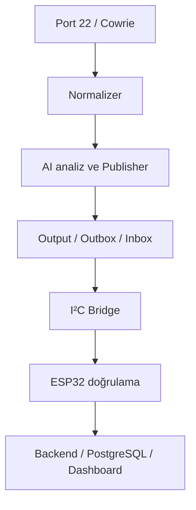

# CyberHunter — Central Processing Unit

CyberHunter'ın Raspberry Pi 5 tabanlı Merkezi İşleme Birimi (Central Processing Unit) için teknik dokümantasyon, geri kazanılmış kaynak kod, yapılandırma örnekleri ve doğrulama kayıtları.

> Bu repo, CyberHunter projesinin tamamına ait monorepo değildir. Raspberry Pi üzerinde kurulan yönetim, honeypot, olay işleme, AI-publisher ve ESP32 bridge hattını belgeler. ESP32 firmware'i, röle elektroniği ve dashboard/backend kaynak kodu yalnızca arayüz sınırları bakımından ele alınır.

## Durum

| Alan | Durum | Son doğrulama kaynağı |
|---|---|---|
| Raspberry Pi ve Ubuntu kurulumu | ✅ Tamamlandı | Stage 1 kanıtları |
| Yönetim SSH ayrıştırması | ✅ Tamamlandı | Stage 2 kanıtları |
| Python ortam ayrıştırması | 🟡 Kısmi | Stage 3 servis bağlama kanıtı |
| Cowrie + paket yakalama | ✅ Tamamlandı | Stage 4–5 kanıtları |
| Normalizer + AI + Publisher | 🟡 Prototip doğrulandı | Stage 6–8 kanıtları; bağımsız AI saha testi açık |
| Bridge kuyruk hattı | ✅ Tamamlandı | Stage 9 teslim/retry kanıtları |
| I²C + AES-GCM + ACK | ✅ Prototip doğrulandı | Stage 10–12 kanıtları |
| Backend/dashboard entegrasyonu | ✅ Arayüz doğrulandı | Stage 13–15 kanıtları |
| Röle prototipi | ✅ LED/kanal testi tamamlandı | Stage 16–17 kanıtları |
| Güncel ESP32 firmware | 🟡 Derleme/runtime doğrulandı | Stage 18; secret/TLS iyileştirmeleri açık |
| Uçtan uca son test | 🟡 Kısmi | Stage 19; tek Cowrie event ID zinciri açık |

## Sistem akışı



## Stage dokümantasyonu

Tüm gelişim süreci [Stage dizininde](docs/stages/README.md) 19 ayrı aşama olarak belgelenmiştir. Aşamalarda amaç, yapılan işler, doğrulama, güvenlik notları, sorumluluk sınırı ve mevcut kanıt bağlantıları bulunur.

## Gerçek kaynak kodlar

Bu repoya yalnızca sohbet geçmişinde tam içeriği doğrulanabilen dosyalar alınmıştır:

- `src/cyberhunter_cpu/normalizer.py`: Cowrie ve SMTP olaylarını ortak şemaya dönüştüren güncel sürüm.
- `src/cyberhunter_cpu/inbox_worker.py`: Inbox → ESP32 teslimi, şema kontrolü, retry, archive/rejected ve state yönetimi.
- `configs/systemd/cyberhunter-inbox-worker.service`: gerçek systemd servis tanımı.
- `configs/systemd/cyberhunter-inbox-worker.timer`: gerçek timer tanımı.
- `configs/systemd/*.example`: sistem çıktısından geri kazanılmış, ortam bağımlı örnek unit dosyaları.

Eksik veya yalnızca parçası görülen dosyalar uydurulmamıştır; [kaynak envanterinde](docs/source-inventory.md) listelenmiştir.

## Hızlı başlangıç

```bash
python -m venv .venv
source .venv/bin/activate
python -m pip install -e '.[dev]'
pytest
ruff check .
```

## Repo düzeni

- `docs/`: stage anlatımları, güvenlik, GitHub ayarları ve kanıt planı
- `src/`: doğrulanmış Python kaynakları
- `configs/`: örnek yapılandırmalar ve systemd unit'leri
- `tests/`: birim, entegrasyon, güvenlik ve donanım test alanları
- `evidence/`: anonimleştirilmiş komut çıktıları, ekran görüntüleri ve fotoğraflar
- `.github/`: PR/issue şablonları, CODEOWNERS, CI ve Settings App yapılandırması

## Kanıt ve görseller

Stage 1–18 için anonimleştirilmiş komut çıktısı, test sonucu veya görsel kanıt
bulunur. Stage 19 için parçalı zincirlerin kanıtları mevcut olsa da tek bir
Cowrie olayının bütün hat boyunca izlendiği bağımsız kabul kaydı henüz yoktur.
Kapsam ve açıklar [Kanıt Listesi](docs/visual-evidence-checklist.md) ile
[Güncel Durum](CURRENT_STATUS.md) dosyalarında tutulur.

Repo yapısını yerelde denetlemek için:

```bash
python scripts/validation/audit_repository.py
```

## Güvenlik

Gerçek IP, MAC adresi, Wi-Fi parolası, SSH private key, token, PCAP veya anonimleştirilmemiş saldırı logu bu repoya eklenmemelidir. Ayrıntılar için [SECURITY.md](SECURITY.md).

## Katkı

Değişiklikler branch + pull request modeliyle alınır. `main` branch'ine doğrudan push kapatılmalıdır. Ayrıntılar için [CONTRIBUTING.md](CONTRIBUTING.md), [Yeni Repo Kurulumu](docs/new-repository-setup.md) ve [GitHub Repo Ayarları](docs/github-repository-settings.md).
