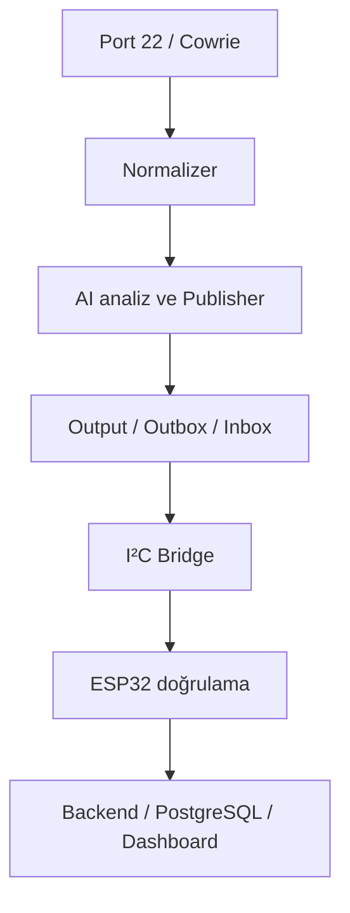

# CyberHunter — Central Processing Unit

CyberHunter'ın Raspberry Pi 5 tabanlı Merkezi İşleme Birimi (Central Processing Unit) için teknik dokümantasyon, geri kazanılmış kaynak kod, yapılandırma örnekleri ve doğrulama kayıtları.

> Bu repo, CyberHunter projesinin tamamına ait monorepo değildir. Raspberry Pi üzerinde kurulan yönetim, honeypot, olay işleme, AI-publisher ve ESP32 bridge hattını belgeler. ESP32 firmware'i, röle elektroniği ve dashboard/backend kaynak kodu yalnızca arayüz sınırları bakımından ele alınır.

## Durum

| Alan | Durum | Son doğrulama kaynağı |
|---|---|---|
| Raspberry Pi ve Ubuntu kurulumu | ✅ Tamamlandı | Dökümenterya, Stage 1 |
| Yönetim SSH ayrıştırması | ✅ Tamamlandı | Dökümenterya, Stage 2 |
| Cowrie + paket yakalama | ✅ Tamamlandı | Dökümenterya, Stage 4–5 |
| Normalizer + AI + Publisher | ✅ Tamamlandı | Dökümenterya, Stage 6–8 |
| Bridge kuyruk hattı | ✅ Tamamlandı | Dökümenterya, Stage 9 |
| I²C + AES-GCM + ACK | ✅ Tamamlandı | Dökümenterya, Stage 10–12 |
| Backend/dashboard entegrasyonu | ✅ Arayüz doğrulandı | Dökümenterya, Stage 13–15 |
| Röle prototipi | ✅ LED/kanal testi tamamlandı | Dökümenterya, Stage 16–17 |
| Güncel ESP32 firmware | 🟡 Derleme/yükleme bekliyor | Dökümenterya, Stage 18 |
| Uçtan uca son test | ⬜ Planlandı | Dökümenterya, Stage 19 |

## Sistem akışı



## Stage dokümantasyonu

Tüm gelişim süreci [Stage dizininde](docs/stages/README.md) 19 ayrı aşama olarak belgelenmiştir. Her aşamada amaç, yapılan işler, doğrulama, güvenlik notları, sorumluluk sınırı ve hazır görsel URL alanı bulunur.

## Gerçek kaynak kodlar

Bu repoya yalnızca sohbet geçmişinde tam içeriği doğrulanabilen dosyalar alınmıştır:

- `src/cyberhunter_cpu/normalizer.py`: Cowrie ve SMTP olaylarını ortak şemaya dönüştüren güncel sürüm.
- `src/cyberhunter_cpu/inbox_worker.py`: Inbox → ESP32 teslimi, şema kontrolü, retry, archive/rejected ve state yönetimi.
- `configs/systemd/cyberhunter-inbox-worker.service`: gerçek systemd servis tanımı.
- `configs/systemd/cyberhunter-inbox-worker.timer`: gerçek timer tanımı.
- `configs/systemd/*.example`: sistem çıktısından geri kazanılmış, ortam bağımlı örnek unit dosyaları.

Eksik veya yalnızca parçası görülen dosyalar uydurulmamıştır; [kaynak envanterinde](docs/source-inventory.md) listelenmiştir.

## Hızlı başlangıç

```bash
python -m venv .venv
source .venv/bin/activate
python -m pip install -e '.[dev]'
pytest
ruff check .
```

## Repo düzeni

- `docs/`: stage anlatımları, güvenlik, GitHub ayarları ve kanıt planı
- `src/`: doğrulanmış Python kaynakları
- `configs/`: örnek yapılandırmalar ve systemd unit'leri
- `tests/`: birim, entegrasyon, güvenlik ve donanım test alanları
- `evidence/`: anonimleştirilmiş komut çıktıları, ekran görüntüleri ve fotoğraflar
- `.github/`: PR/issue şablonları, CODEOWNERS, CI ve Settings App yapılandırması

## Kanıt ve görseller

Görsel dosyalar şimdilik eklenmemiştir. Her stage dosyasında `PASTE_IMAGE_URL_HERE_...` biçiminde hazır URL alanı bulunur. Çekilecek görsellerin toplu listesi [Görsel Kanıt Listesi](docs/visual-evidence-checklist.md) dosyasındadır.

## Güvenlik

Gerçek IP, MAC adresi, Wi-Fi parolası, SSH private key, token, PCAP veya anonimleştirilmemiş saldırı logu bu repoya eklenmemelidir. Ayrıntılar için [SECURITY.md](SECURITY.md).

## Katkı

Değişiklikler branch + pull request modeliyle alınır. `main` branch'ine doğrudan push kapatılmalıdır. Ayrıntılar için [CONTRIBUTING.md](CONTRIBUTING.md), [Yeni Repo Kurulumu](docs/new-repository-setup.md) ve [GitHub Repo Ayarları](docs/github-repository-settings.md).
