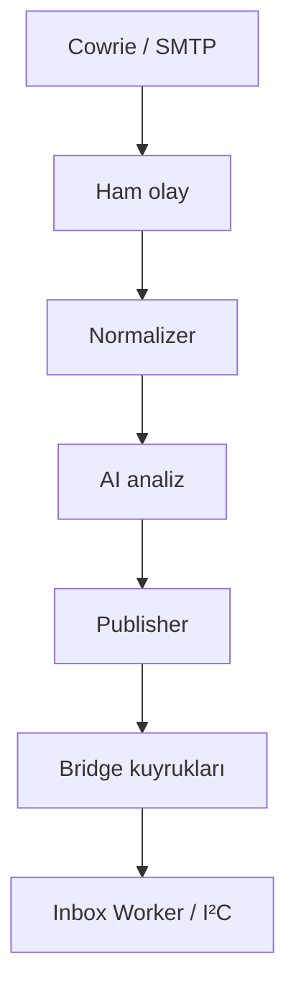

# Olay İşleme Akışı

```mermaid
flowchart TD
    A["Cowrie / SMTP"] --> B["Ham olay"]
    B --> C["Normalizer"]
    C --> D["AI analiz"]
    D --> E["Publisher"]
    E --> F["Bridge kuyrukları"]
    F --> G["Inbox Worker / I²C"]
```

