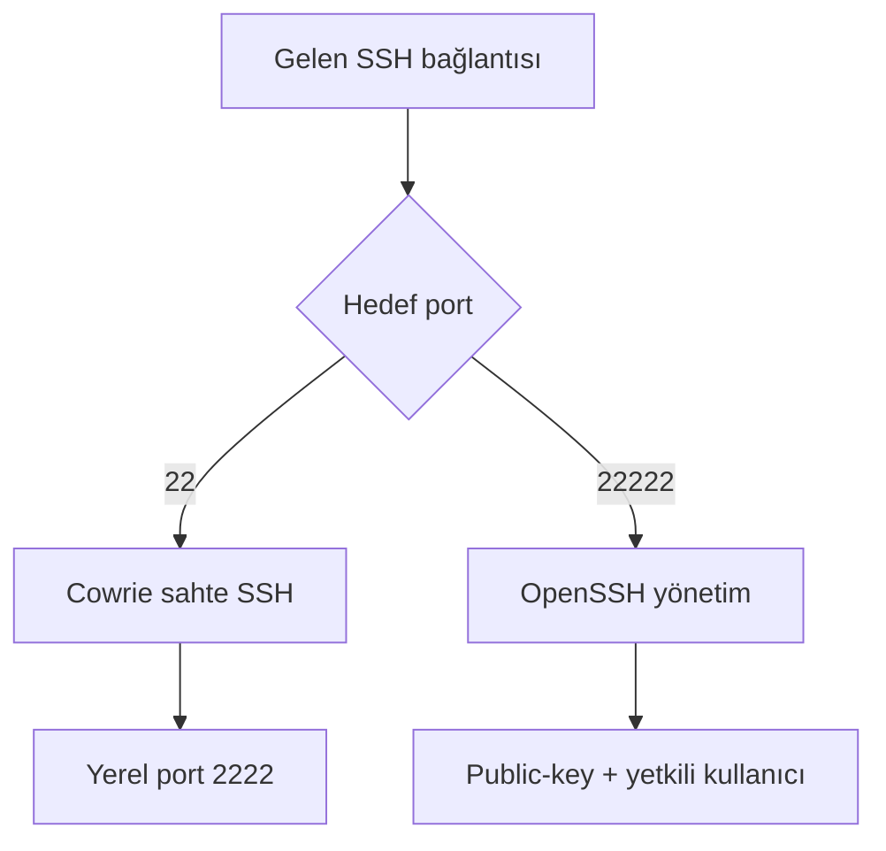

# Yönetim ve Sahte SSH Akışı

```mermaid
flowchart TD
    A["Gelen SSH bağlantısı"] --> B{"Hedef port"}
    B -->|22| C["Cowrie sahte SSH"]
    C --> D["Yerel port 2222"]
    B -->|22222| E["OpenSSH yönetim"]
    E --> F["Public-key + yetkili kullanıcı"]
```

