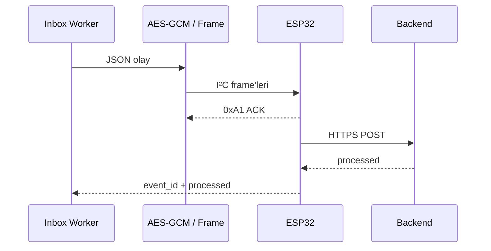

# Raspberry Pi–ESP32 Veri Akışı

```mermaid
sequenceDiagram
    participant W as Inbox Worker
    participant C as AES-GCM / Frame
    participant E as ESP32
    participant B as Backend
    W->>C: JSON olay
    C->>E: I²C frame'leri
    E-->>C: 0xA1 ACK
    E->>B: HTTPS POST
    B-->>E: processed
    E-->>W: event_id + processed
```

