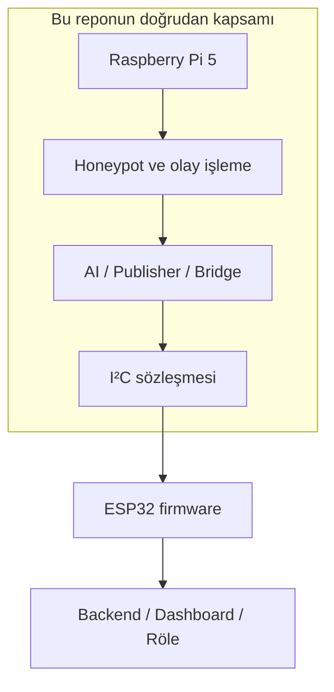

# Sorumluluk Sınırı

```mermaid
flowchart TD
    A["Raspberry Pi 5"] --> B["Honeypot ve olay işleme"]
    B --> C["AI / Publisher / Bridge"]
    C --> D["I²C sözleşmesi"]
    D --> E["ESP32 firmware"]
    E --> F["Backend / Dashboard / Röle"]
    subgraph Repo["Bu reponun doğrudan kapsamı"]
      A
      B
      C
      D
    end
```

