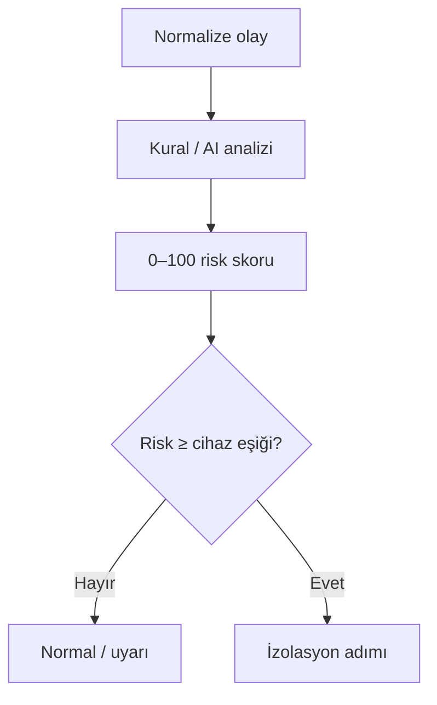

# Risk Değerlendirme Akışı

```mermaid
flowchart TD
    A["Normalize olay"] --> B["Kural / AI analizi"]
    B --> C["0–100 risk skoru"]
    C --> D{"Risk ≥ cihaz eşiği?"}
    D -->|Hayır| E["Normal / uyarı"]
    D -->|Evet| F["İzolasyon adımı"]
```

