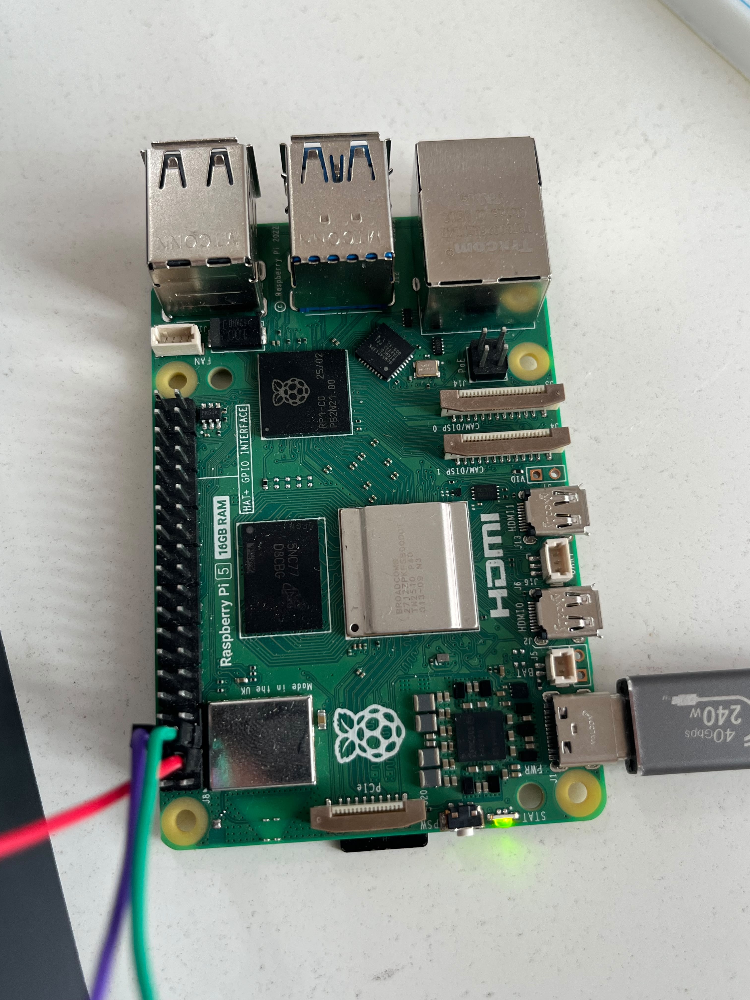

# Stage 1 — Raspberry Pi ve İşletim Sistemi Kurulumu

**Durum:** ✅ Tamamlandı
**Sorumluluk:** Merkezi İşleme Birimi

## Amaç

CyberHunter sisteminin sürekli çalışacak merkezi düğümünü Raspberry Pi 5
üzerinde kurmak ve sonraki güvenlik, honeypot, olay işleme ve donanım
haberleşmesi aşamaları için kararlı bir Ubuntu Server ortamı hazırlamak.

## Kullanılan donanım

| Bileşen | Özellik | Durum | Açıklama |
|---|---|---:|---|
| Ana işlem birimi | Raspberry Pi 5 | ✅ Hazır | Merkezi İşleme Birimi |
| Bellek | 16 GB RAM | ✅ Doğrulandı | Sistem kaynak çıktısıyla kontrol edildi |
| Ana depolama | 64 GB SanDisk Ultra microSD | ✅ Kullanılıyor | Ubuntu Server bu ortamda çalışıyor |
| Ek depolama | 128 GB USB bellek | ✅ Mevcut | İlk başlatma denemelerinde kullanıldı |
| Güç adaptörü | 5V 3A | ✅ Kullanılıyor | Prototip geliştirme ortamı |
| Aktif soğutma | Fan bulunmuyor | 🟡 İzleniyor | Sıcaklık takibi gerekiyor |
| ESP32 bağlantısı | I2C üzerinden planlandı | ⬜ Sonraki aşama | Bu aşamanın kapsamı dışında |

## Yapılan çalışmalar

- Ana işlem birimi olarak 16 GB Raspberry Pi 5 seçildi.
- USB bellek üzerinden başlatma denemeleri gerçekleştirildi.
- Başlatma sırasında güç ve durum LED’lerinin davranışı gözlemlendi.
- USB üzerinden kararlı kurulum sağlanamadığı için 64 GB microSD kullanıldı.
- Raspberry Pi Imager ile Ubuntu Server 24.04.4 LTS kuruldu.
- Sistemin `noble` kod adına ve `arm64` mimarisine sahip olduğu doğrulandı.
- Aktif kernel sürümü `6.8.0-1060-raspi` olarak doğrulandı.
- Hostname değeri `cyberhunter-pi` olarak yapılandırıldı.
- Saat dilimi `Europe/Istanbul` olarak ayarlandı.
- Ağ zaman eşitlemesinin (Network Time Protocol — NTP) aktif olduğu doğrulandı.
- Üniversitenin ortak Ethernet ağıyla bağlantı denenmiş ancak bağlantı sağlanamamıştır.
- Geliştirme ortamında `CyberHunter-Lab` mobil erişim noktası kullanılmıştır.
- Raspberry Pi’nin kablosuz ağ üzerinden erişilebilir olduğu doğrulanmıştır.
- OpenSSH Server kurulmuş ve sonraki aşamada güvenli yönetim için yapılandırılmıştır.

## Doğrulanan sistem bilgileri

| Özellik | Doğrulanan değer |
|---|---|
| İşletim sistemi | Ubuntu Server 24.04.4 LTS |
| Ubuntu kod adı | `noble` |
| Mimari | `arm64` / `aarch64` |
| Kernel | `6.8.0-1061-raspi` |
| Hostname | `cyberhunter-pi` |
| Saat dilimi | `Europe/Istanbul` |
| NTP senkronizasyonu | Aktif |
| Ana ağ arayüzü | `wlan0` |
| Gerçek IP adresi | Güvenlik nedeniyle maskelendi |
| Aktif soğutma | Bulunmuyor |

## Kurulum sürecinde karşılaşılan durumlar

### USB üzerinden başlatma

İlk kurulum aşamasında Ubuntu Server’ın USB bellek üzerinden başlatılması
denenmiştir. Başlatma sırasında durum LED’leri gözlemlenmiş ancak kararlı
bir işletim sistemi kurulumu elde edilememiştir.

USB üzerinden başlatma probleminin kesin kök nedeni belirlenmemiştir.
Güç kaynağı, önyükleme sırası ve USB ortam uyumluluğu olası nedenler
olarak değerlendirilmiştir.

### microSD üzerinden kurulum

Kuruluma 64 GB microSD kart üzerinden devam edilmiş ve Ubuntu Server
24.04.4 LTS başarıyla çalıştırılmıştır. Aktif sistem bu microSD kart
üzerinde çalışmaktadır.

### Ağ bağlantısı

Üniversitenin ortak Ethernet ağı üzerinden bağlantı sağlanamamıştır.
Geliştirme ve test sürecinde mobil erişim noktası kullanılmıştır.

Repo içerisinde gerçek SSID parolası, IP adresi, ağ geçidi veya MAC adresi
paylaşılmamaktadır.

## Test ve doğrulama sonuçları

| Kontrol | Beklenen sonuç | Gerçekleşen sonuç | Durum |
|---|---|---|---|
| Ubuntu sürümü | Ubuntu Server 24.04.4 LTS | Sürüm doğrulandı | ✅ Başarılı |
| Ubuntu kod adı | `noble` | Kod adı doğrulandı | ✅ Başarılı |
| Sistem mimarisi | `arm64` | Mimari doğrulandı | ✅ Başarılı |
| Kernel sürümü | Raspberry Pi kernel’i | `6.8.0-1061-raspi` görüldü | ✅ Başarılı |
| Hostname | `cyberhunter-pi` | Hostname doğrulandı | ✅ Başarılı |
| Saat dilimi | `Europe/Istanbul` | Saat dilimi doğrulandı | ✅ Başarılı |
| NTP servisi | Aktif ve etkin olmalı | `active` ve `enabled` görüldü | ✅ Başarılı |
| NTP senkronizasyonu | Saat senkronize olmalı | `NTPSynchronized=no`, paket sayısı `0` | 🟡 İnceleniyor |
| RAM | Yaklaşık 16 GB | 15 GiB kullanılabilir bellek görüldü | ✅ Başarılı |
| Kök dosya sistemi | microSD üzerinde çalışmalı | `/dev/mmcblk0p2`, ext4 doğrulandı | ✅ Başarılı |
| Swap alanı | İhtiyaca göre değerlendirilmelidir | Swap bulunmuyor | 🟡 İzlenmeli |
| Ağ yöneticisi | Sunucu ağını yönetmeli | `systemd-networkd` aktif | ✅ Başarılı |
| Kablosuz arayüz | `wlan0` aktif olmalı | `routable`, `configured`, `online` | ✅ Başarılı |
| CPU sıcaklığı | Okunabilir olmalı | `45.8°C` ölçüldü | ✅ Başarılı |
| Uzun süreli sıcaklık | Güvenli aralıkta kalmalı | Henüz test edilmedi | ⬜ Planlandı |

## Kanıtlar

### Donanım kanıtı

- [Raspberry Pi 5 donanım fotoğrafı](../../evidence/hardware-photos/2026-09-30_stage-01_raspberry-pi5-hardware_photo.jpeg)

### Sistem kanıtları

- [İşletim sistemi, kernel, mimari, hostname ve NTP](../../evidence/command-outputs/2026-10-01_stage-01_system-information.txt)
- [RAM ve depolama durumu](../../evidence/command-outputs/2026-10-01_stage-01_system-resources.txt)
- [Anonimleştirilmiş ağ durumu](../../evidence/command-outputs/2026-10-01_stage-01_network-status-sanitized.txt)
- [CPU sıcaklık ölçümü](../../evidence/command-outputs/2026-10-01_stage-01_temperature.txt)

## Güvenlik ve gizlilik

Bu aşamaya ait kanıtlarda aşağıdaki bilgiler paylaşılmamaktadır:

- Gerçek yerel IP adresleri
- MAC adresleri
- Wi-Fi parolası
- Ağ geçidi ve DNS adresleri
- Donanım seri numaraları
- SSH anahtarları
- Gerçek kullanıcı kimlik bilgileri

## Bilinen sınırlamalar

- Raspberry Pi üzerinde aktif fan bulunmamaktadır.
- Sıcaklık ölçümü belirli bir andaki değeri gösterir; uzun süreli yük testi değildir.
- USB üzerinden başlatma probleminin kesin kök nedeni belirlenmemiştir.
- Üniversite Ethernet bağlantısının neden çalışmadığı kesinleştirilmemiştir.
- Uzun süreli kararlılık ve termal yük testi henüz yapılmamıştır.

## Sonraki adımlar

- Düzenli sıcaklık takibi yapılması
- Aktif soğutma ihtiyacının değerlendirilmesi
- Uzun süreli sistem yük testinin gerçekleştirilmesi
- Disk kullanımının ve log büyümesinin izlenmesi
- Sistem yedekleme yönteminin hazırlanması

## Sonuç

Raspberry Pi 5 üzerinde Ubuntu Server 24.04.4 LTS kurulmuştur. İşletim
sistemi sürümü, `arm64` mimarisi, `6.8.0-1061-raspi` kernel sürümü,
hostname, saat dilimi, bellek, microSD depolama, kablosuz ağ durumu ve
anlık CPU sıcaklığı kanıt dosyalarıyla doğrulanmıştır.

Kablosuz ağ, Netplan ile uyumlu `systemd-networkd` servisi tarafından
yönetilmektedir. `wlan0` arayüzünün yapılandırılmış, yönlendirilebilir ve
çevrim içi olduğu görülmüştür.

NTP servisi aktif ve sistem başlangıcında etkin durumdadır. Ancak ölçüm
sırasında NTP paket alışverişi gerçekleşmediği ve
`NTPSynchronized=no` sonucu alındığı için saat senkronizasyonu açık
teknik görev olarak kaydedilmiştir.

İşletim sistemi kurulumu tamamlanmıştır. NTP senkronizasyonu, swap
gereksinimi ve uzun süreli termal izleme geliştirme görevleri olarak
devam etmektedir.
