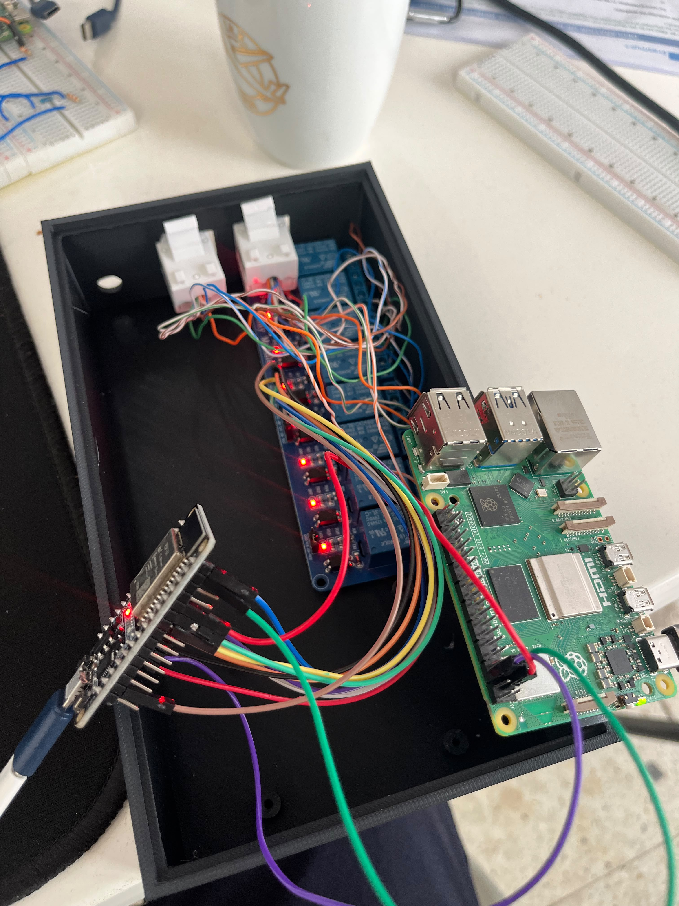
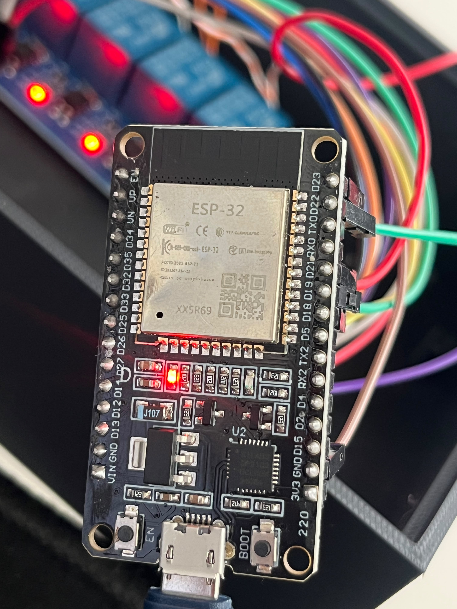
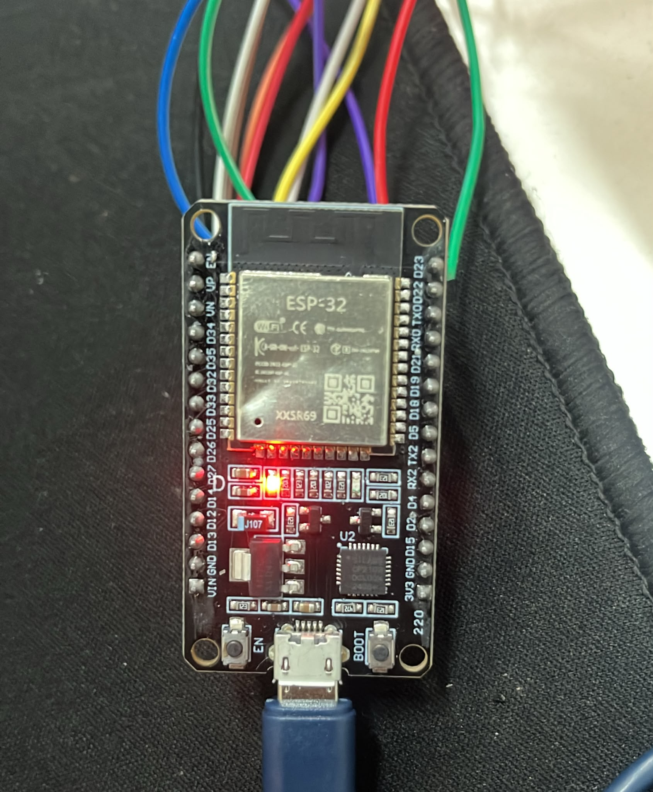
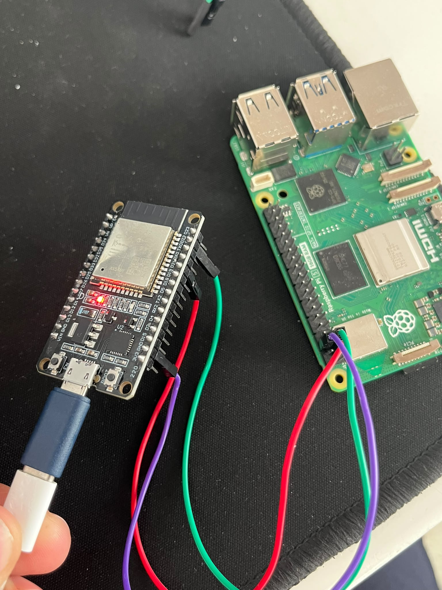

# Stage 10 — Raspberry Pi ve ESP32 Arasında I²C

**Durum:** ✅ Tamamlandı
**Tamamlanma kapsamı:** Raspberry Pi tarafındaki istemci, fiziksel bağlantı,
adres algılama ve kontrollü şifreli mesaj alışverişi
**Sorumluluk:** Raspberry Pi tarafı bu repo kapsamında; ESP32 firmware'i
entegrasyon sınırındadır

## Amaç

Bridge kuyruğundaki doğrulanmış olayları Raspberry Pi'den ESP32'ye I²C
üzerinden iletmek, büyük mesajları sabit boyutlu frame'lere bölmek ve ESP32
cevabını güvenli biçimde yeniden birleştirerek ilgili olayla eşleştirmek.

Bu aşama rölenin fiziksel izolasyon oluşturduğunu doğrulamaz. Röle bağlantısı,
LED davranışı ve fiziksel kesme senaryosu sonraki donanım aşamalarında ayrıca
belgelenir.

## Fiziksel bağlantı

| Raspberry Pi 5 | Fiziksel pin | ESP32 | Görev |
|---|---:|---|---|
| GPIO2 / SDA1 | 3 | GPIO21 / SDA | I²C veri hattı |
| GPIO3 / SCL1 | 5 | GPIO22 / SCL | I²C saat hattı |
| GND | Uygun GND pini | GND | Ortak referans |

> Not: GPIO21 ve GPIO22, ESP32 tarafındaki pinlerdir. Raspberry Pi tarafında
> I²C1 için GPIO2 ve GPIO3 kullanılır.

## I²C yapılandırması

| Alan | Doğrulanan değer |
|---|---|
| Raspberry Pi I²C aygıtı | `/dev/i2c-1` |
| ESP32 hedef adresi | `0x08` |
| Raspberry Pi rolü | I²C controller |
| ESP32 rolü | I²C target |
| İstemci dosyası | `/opt/cyberhunter/apps/bridge/esp32_tests/esp32_client.py` |

`i2cdetect -y 1` taramasında `0x08` adresi görüldü. Bu sonuç ESP32'nin veri
yolunda adreslenebildiğini gösterir; tek başına uygulama protokolünün doğru
çalıştığını kanıtlamaz. Protokol ayrıca kontrollü çift yönlü mesaj testiyle
doğrulandı.

## Inbox Worker istemci seçimi

Inbox Worker aşağıdaki istemciyi açık dosya yolu üzerinden yükler:

```text
/opt/cyberhunter/apps/bridge/esp32_tests/esp32_client.py
```

Worker, içe aktarılan modülün gerçek dosya yolunu denetler ve farklı bir
`esp32_client.py` yüklenirse işlemi hata ile durdurur. Doğrulama sırasında
kaydedilen SHA-256 değerleri:

| Dosya | SHA-256 |
|---|---|
| `esp32_tests/esp32_client.py` | `1a192bdb55e35d0b69e03621a6f83e1a96dd671ee0700dcf98f65c3e22ffee60` |
| `inbox_worker.py` | `abb19c768d2c7e1975adfa3c97164caf9c867a34f4db40334ab1f8cbf35344e0` |

Bu özet değerleri yalnızca doğrulanan sürümü tanımlamak içindir; yazılımın
güvenli olduğuna tek başına kanıt oluşturmaz.

## Frame protokolü

I²C üzerinden gönderilen her frame 32 bayttır. Uygulama yükü en fazla 20
bayttır.

| Bayt aralığı | Uzunluk | İçerik |
|---:|---:|---|
| `0` | 1 | Frame magic: `0xC7` |
| `1` | 1 | Protokol sürümü: `1` |
| `2` | 1 | Frame türü/yön bilgisi |
| `3–4` | 2 | 16 bit `message_id`, big-endian |
| `5` | 1 | Frame sıra numarası |
| `6` | 1 | Toplam frame sayısı |
| `7` | 1 | Bu frame'deki payload uzunluğu |
| `8–9` | 2 | Toplam blob uzunluğu, big-endian |
| `10–29` | 20 | Payload alanı |
| `30–31` | 2 | CRC-16/CCITT |

CRC değeri ilk 30 bayt üzerinden `crc_hqx(..., 0xFFFF)` ile hesaplanır.
Alıcı tarafta magic, sürüm, mesaj kimliği, frame sayısı, sıra numarası, payload
uzunluğu, toplam uzunluk ve CRC denetlenir.

## Mesaj kimliği ve olay kimliği

`message_id`, tek bir parçalı I²C mesajına ait frame'leri bir arada tutan
16 bit protokol değeridir. Raspberry Pi'nin gönderdiği istek ile ESP32'nin
döndürdüğü cevap ayrı mesajlardır; bu nedenle TX ve RX `message_id`
değerlerinin aynı olması beklenmez.

Uçtan uca olay eşleşmesi, şifreli JSON içindeki `event_id` alanıyla yapılır.
Inbox Worker, ESP32 cevabındaki `event_id` ile gönderdiği olayın `event_id`
değerini karşılaştırır.

## ACK davranışı

Kaynak kod incelemesinde Raspberry Pi'nin, ESP32'den aldığı geçerli cevap
frame'lerinden sonra ESP32'ye `0xA1` ACK baytı yazdığı doğrulandı. Önceki frame
yeniden gelirse Raspberry Pi aynı ACK baytını tekrar gönderir.

Bu nedenle ACK yönü şöyledir:

```text
ESP32 cevap frame'i → Raspberry Pi doğrulaması → Raspberry Pi'den 0xA1 ACK
```

Raspberry Pi'den ESP32'ye giden olay frame'lerinde ise mevcut istemci, her
32 baytlık yazmanın eksiksiz tamamlandığını kontrol eder; ESP32'den ayrı bir
frame ACK'i okumaz.

## Kontrollü çift yönlü test

Stage 9 kapsamında üretilen kontrollü olay, aynı zamanda I²C veri yolunun
uçtan uca doğrulanması için kullanıldı.

```text
Inbox Worker
→ 250 bayt JSON
→ AES-GCM ile 282 bayt blob
→ 15 TX frame
→ ESP32
→ 187 bayt şifreli cevap
→ 10 RX frame
→ yeniden birleştirme
→ AES-GCM doğrulama ve çözme
→ event_id eşleştirme
```

Doğrulanan test sonuçları:

| Kontrol | Gerçekleşen sonuç | Durum |
|---|---|---|
| I²C aygıtı | `/dev/i2c-1` bulundu | ✅ Başarılı |
| ESP32 adresi | `0x08` taramada görüldü | ✅ Başarılı |
| Olay gönderimi | `ESP32 SEND: OK` | ✅ Başarılı |
| TX parçalama | 282 bayt, 15 frame | ✅ Başarılı |
| RX yeniden birleştirme | 187 bayt, 10 frame | ✅ Başarılı |
| Frame bütünlüğü | `FRAME REASSEMBLY: OK` | ✅ Başarılı |
| Kimlik doğrulama | `AES-GCM AUTH: OK` | ✅ Başarılı |
| Şifre çözme | `AES-GCM DECRYPT: OK` | ✅ Başarılı |
| Olay eşleşmesi | `EVENT_ID MATCH: OK` | ✅ Başarılı |
| ESP32 işlem sonucu | `processed: true` | ✅ Başarılı |
| Kuyruk sonucu | Olay `archive` dizinine taşındı | ✅ Başarılı |

İlk denemede ESP32 bir cevap üretmiş ancak `processed: false` bildirmiştir.
Worker olayı başarı saymamış ve yeniden deneme planlamıştır. İkinci denemede
aynı olay `processed: true` cevabıyla tamamlanmış, durum kaydı `success` olmuş
ve dosya arşive taşınmıştır. Bu davranış, yalnızca veri alışverişinin değil,
uygulama seviyesindeki sonuç kontrolünün de çalıştığını gösterir.

## Kanıtlar

### Komut çıktıları ve test sonucu

- [I²C aygıtı ve adres taraması](../../evidence/command-outputs/2026-10-01_stage-10_i2c-device-scan.txt)
- [İstemci ve frame protokolü doğrulaması](../../evidence/command-outputs/2026-10-01_stage-10_i2c-client-protocol.txt)
- [Şifreli çift yönlü I²C testi](../../evidence/test-results/2026-10-01_stage-10_encrypted-i2c-roundtrip.txt)

### Donanım fotoğrafları









## Güvenlik ve güvenilirlik sınırı

- I²C fiziksel olarak güvenilir bir taşıma ortamı kabul edilmemelidir.
- AES anahtarı, nonce üretim ayrıntıları ve diğer gizli değerler repoya
  eklenmemelidir.
- CRC aktarım hatalarını yakalamak içindir; kriptografik bütünlük sağlamaz.
  Mesaj kimlik doğrulaması AES-GCM etiketiyle yapılır.
- `processed: true` alınmadan olay başarıyla teslim edilmiş kabul edilmez.
- Zaman aşımı, hatalı frame, CRC uyuşmazlığı, AES-GCM doğrulama hatası ve
  `event_id` uyuşmazlığı başarı olarak kaydedilmez.
- Bu test röle kontağını, elektriksel izolasyonu veya gerçek yük kesilmesini
  doğrulamaz.

## Açık iyileştirmeler

- Hat gerilimleri ve pull-up dirençlerini ölçümle belgelemek.
- Uzun süreli ve tekrarlı mesaj testleri yapmak.
- Kablo uzunluğu ve elektriksel gürültü altında hata oranını ölçmek.
- I²C bus kilitlenmesi için kurtarma prosedürü eklemek.
- Protokol sürümünü bağımsız bir teknik sözleşmede belgelemek.
- Gerekirse logic analyzer ile SDA/SCL zamanlamasını doğrulamak.

## Sonuç

Raspberry Pi'nin `/dev/i2c-1` üzerinden `0x08` adresli ESP32'yi gördüğü,
olayı 32 baytlık frame'lere bölerek gönderdiği, ESP32'nin şifreli cevabının
yeniden birleştirilip doğrulandığı ve cevap içindeki `event_id` değerinin
başlangıç olayıyla eşleştiği kontrollü testle doğrulanmıştır.

Stage 10, Raspberry Pi–ESP32 I²C entegrasyonu kapsamında tamamlanmıştır.
Röle ve fiziksel izolasyon davranışı bu tamamlanma iddiasının dışındadır.
