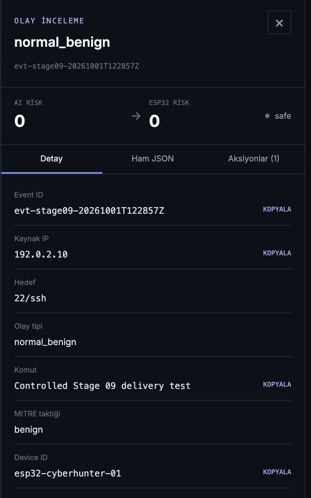

# Stage 14 — Backend, PostgreSQL ve Dashboard

**Durum:** ✅ Entegrasyon doğrulandı
**Tamamlanma kapsamı:** FastAPI kabulü, PostgreSQL korelasyonu, `event_id`
benzersizliği ve dashboard görünümü
**Sorumluluk:** Backend, veritabanı ve dashboard kapsam dışı bileşenlerdir;
bu repo yalnızca Merkezi İşleme Birimiyle arayüz sözleşmesini belgeler

## Amaç

Raspberry Pi'den başlayarak ESP32 üzerinden backend'e iletilen bir güvenlik
olayının FastAPI tarafından erişilebilir olduğunu, PostgreSQL tablolarında aynı
`event_id` ile kaydedildiğini ve dashboard'da aynı olay olarak
görüntülendiğini doğrulamak.

Referans olay kimliği:

```text
evt-stage09-20261001T122857Z
```

## Doğrulanan uçtan uca akış

```text
Raspberry Pi Bridge
→ Şifreli I2C
→ ESP32
→ POST /api/security-events
→ FastAPI
→ PostgreSQL
├── security_events
├── esp32_assessments
└── response_actions
→ Backend GET API
→ Dashboard
```

## Çalışan FastAPI sözleşmesi

Çalışan backend'in OpenAPI `3.1.0` tanımı incelenmiştir.

| Yöntem | Endpoint | Görev |
|---|---|---|
| `GET` | `/api/security-events` | Olay listeleme ve filtreleme |
| `POST` | `/api/security-events` | Yeni güvenlik olayı oluşturma |
| `GET` | `/api/security-events/summary` | Güvenlik olayı özeti |
| `GET` | `/api/security-events/{event_id}` | Tek olayı kimliğiyle getirme |

Listeleme endpoint'inde limit, offset, arama, tarih aralığı, kaynak IP,
protokol, olay türü, risk aralığı, karar, işlenme durumu ve sıralama
parametreleri bulunmaktadır.

## Firmware–backend sorgu uyumsuzluğu

ESP32 firmware kaynak kodunda sorgu için:

```text
POST /api/security-events/query
```

kullanılmaktadır. Çalışan backend OpenAPI sözleşmesinde bu endpoint yer
almamaktadır. Kontrollü istekte:

```text
HTTP 405 Method Not Allowed
Allow: GET
```

sonucu alınmıştır.

Bu uyumsuzluk güvenlik olayı oluşturma akışını etkilememiştir;
`POST /api/security-events` başarıyla çalışmaktadır. Ancak ESP32 sorgu özelliği
mevcut backend sürümüyle uyumlu değildir ve firmware ya da backend sözleşmesi
tek bir standartta birleştirilmelidir.

## Backend API korelasyonu

Referans olay çalışan endpoint üzerinden sorgulanmıştır:

```text
GET /api/security-events/evt-stage09-20261001T122857Z
```

Doğrulama sonucu:

| Kontrol | Sonuç | Durum |
|---|---|---|
| HTTP durumu | `200` | ✅ Başarılı |
| Aranan `event_id` | `evt-stage09-20261001T122857Z` | Bilgi |
| Dönen `event_id` | Aynı | ✅ Eşleşti |
| Hedef port | `22` | ✅ Mevcut |
| Protokol | `ssh` | ✅ Mevcut |
| Olay türü | `normal_benign` | ✅ Mevcut |
| Komut | Mevcut, 33 karakter | ✅ Mevcut |
| Girdi risk skoru | `0` | ✅ Mevcut |

İlk güvenli API çıktı betiği `timestamp`, ESP32 skoru, karar, işlenme durumu
ve cihaz kimliğini üst seviyede aramıştır. Bu değerlerin bir kısmı API
cevabında farklı alan adlarında veya ayrı değerlendirme kaydında bulunduğu için
`null` görünmüştür. PostgreSQL ve dashboard kanıtları değerlerin gerçekten
bulunduğunu doğrulamaktadır; bu `null` değerler veritabanında veri kaybı olarak
yorumlanmamıştır.

## PostgreSQL veri modeli

Referans olay aynı `event_id` ile üç ilişkili tabloda bulunmuştur:

| Tablo | Görev | Doğrulanan alanlar |
|---|---|---|
| `security_events` | Temel güvenlik olayı | Olay zamanı, port, protokol, olay türü, taktik, girdi risk skoru |
| `esp32_assessments` | ESP32 değerlendirmesi | Cihaz kimliği, ESP32 risk skoru, karar, `processed` |
| `response_actions` | Politika/aksiyon kaydı | Risk, önem seviyesi, aksiyon ve durum |

### `security_events` kaydı

```text
event_id: evt-stage09-20261001T122857Z
protocol: ssh
event_type: normal_benign
tactic: benign
destination_port: 22
input_risk_score: 0
```

### `esp32_assessments` kaydı

```text
event_id: evt-stage09-20261001T122857Z
device_id: esp32-cyberhunter-01
esp32_risk_score: 0
esp32_decision: safe
esp32_processed: true
```

### `response_actions` kaydı

```text
event_id: evt-stage09-20261001T122857Z
action: log_only
status: recorded
severity: normal
risk_score: 0
device_id: esp32-cyberhunter-01
```

Bu yapı temel olayı, ESP32 değerlendirmesini ve uygulanan aksiyonu aynı
`event_id` üzerinden ilişkilendirir.

## Event ID benzersizliği

PostgreSQL indeksleri incelendiğinde:

```text
security_events.event_id
→ UNIQUE INDEX pk_security_events

esp32_assessments.event_id
→ UNIQUE INDEX pk_esp32_assessments

response_actions
→ UNIQUE INDEX (event_id, device_id, action, policy_version)
```

kurallarının bulunduğu doğrulanmıştır.

Referans olayın kayıt sayısı:

| Tablo | Kayıt sayısı |
|---|---:|
| `security_events` | 1 |
| `esp32_assessments` | 1 |
| `response_actions` | 1 |

Bu sonuç, incelenen olayın yinelenmediğini gösterir. `security_events` ve
`esp32_assessments` tablolarındaki unique indeksler aynı `event_id`nin ikinci
kez eklenmesini veritabanı seviyesinde engeller.

## Dashboard doğrulaması

Dashboard olay inceleme görünümünde aynı referans olay açılmıştır.

Görüntüde doğrulanan alanlar:

| Dashboard alanı | Görünen değer |
|---|---|
| Event ID | `evt-stage09-20261001T122857Z` |
| AI risk | `0` |
| ESP32 risk | `0` |
| Karar | `safe` |
| Kaynak IP | `192.0.2.10` |
| Hedef | `22/ssh` |
| Olay türü | `normal_benign` |
| Komut | Kontrollü Stage 09 teslim testi |
| MITRE taktiği | `benign` |
| Device ID | `esp32-cyberhunter-01` |
| Aksiyon sayısı | `1` |

`192.0.2.10`, RFC 5737 kapsamında dokümantasyon ve test için ayrılmış
`TEST-NET-1` adresidir; gerçek saldırgan veya özel ağ adresi değildir.



## Uçtan uca korelasyon sonucu

| Katman | Event ID | Sonuç |
|---|---|---|
| Raspberry Pi test olayı | `evt-stage09-20261001T122857Z` | ✅ |
| ESP32 cevabı | `evt-stage09-20261001T122857Z` | ✅ |
| Backend GET API | `evt-stage09-20261001T122857Z` | ✅ |
| PostgreSQL `security_events` | `evt-stage09-20261001T122857Z` | ✅ |
| PostgreSQL `esp32_assessments` | `evt-stage09-20261001T122857Z` | ✅ |
| PostgreSQL `response_actions` | `evt-stage09-20261001T122857Z` | ✅ |
| Dashboard | `evt-stage09-20261001T122857Z` | ✅ |

## Kanıtlar

- [Backend API korelasyonu](../../evidence/command-outputs/2026-10-01_stage-14_backend-api-correlation.txt)
- [PostgreSQL olay korelasyonu](../../evidence/command-outputs/2026-10-01_stage-14_postgresql-correlation.txt)
- [Event ID benzersizlik kontrolü](../../evidence/command-outputs/2026-10-01_stage-14_event-id-uniqueness.txt)
- [Uçtan uca korelasyon sonucu](../../evidence/test-results/2026-10-01_stage-14_end-to-end-correlation.txt)
- [Dashboard ekran görüntüsü](../../evidence/screenshots/2026-10-01_stage-14_dashboard-event-correlation_sanitized.png)
- [Stage 13 backend POST doğrulaması](../../evidence/test-results/2026-10-01_stage-13_backend-post-validation.txt)

## Kapsam sınırı

Bu repo aşağıdaki bileşenlerin tamamını sahiplenmez:

- FastAPI backend kaynak kodunun tamamı
- PostgreSQL migration ve operasyon yönetimi
- Dashboard frontend kaynak kodu
- Backend kimlik doğrulama ve yetkilendirme tasarımı
- Üretim dağıtım altyapısı

Bu bileşenler yalnızca Merkezi İşleme Biriminden çıkan olayın arayüz ve
korelasyon doğrulaması açısından belgelenmiştir. İlgili ekip reposunun bağlantısı
netleştiğinde bu bölüme eklenmelidir.

## Açık iyileştirmeler

1. Firmware sorgu sözleşmesini çalışan FastAPI endpoint'leriyle uyumlu hâle
   getirmek.
2. Tek olay API cevabında temel olay ve ESP32 değerlendirmesi için açık,
   belgelenmiş bir birleşik response şeması kullanmak.
3. Backend ve dashboard ekip reposuna bağlantı eklemek.
4. Duplicate POST isteğini kontrollü entegrasyon testiyle ayrıca doğrulamak.
5. Dashboard'da `processed` ve backend kayıt zamanını açıkça göstermek.
6. Backend API için kimlik doğrulama ve TLS üretim yapılandırmasını
   doğrulamak.
7. Dashboard üzerinde hassas alan maskeleme politikasını standartlaştırmak.

## Sonuç

Referans güvenlik olayının FastAPI üzerinden HTTP `200` ile alındığı,
PostgreSQL'de temel olay, ESP32 değerlendirmesi ve aksiyon tablolarında aynı
`event_id` ile birer kez saklandığı ve dashboard'da aynı kimlikle
görüntülendiği doğrulanmıştır.

Stage 14, Merkezi İşleme Birimi arayüz sınırı içinde tamamlanmıştır. Firmware
query endpoint'i ile çalışan backend sözleşmesi arasındaki uyumsuzluk açık
entegrasyon görevi olarak kaydedilmiştir.