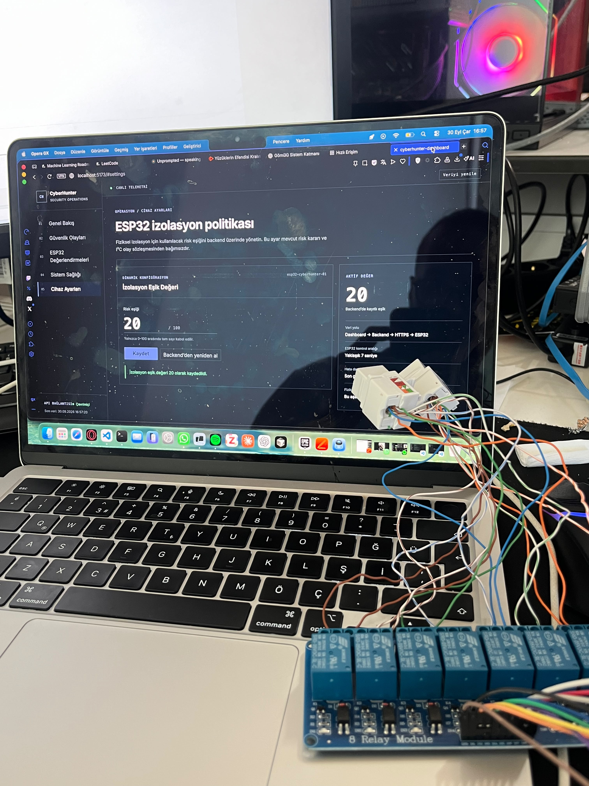
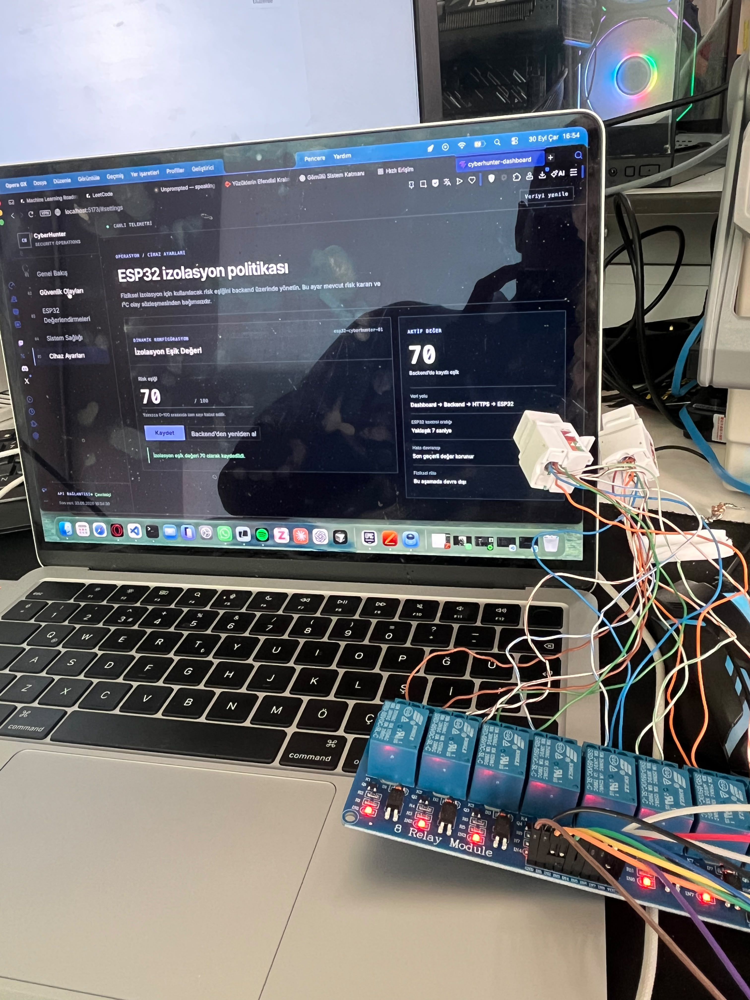

# Stage 15 — Dinamik İzolasyon Eşiği

**Durum:** ✅ Dinamik eşik ve son geçerli değer davranışı doğrulandı
**Sorumluluk:** Dashboard, backend ve ESP32 ortak sözleşmesi; Raspberry Pi aktarım ve doğrulama katmanı

## Amaç

İzolasyon eşiğini firmware içinde sabit bir değere bağlamak yerine cihaz bazında
backend üzerinden yönetmek ve ESP32'nin her güvenlik olayını güncel eşik ile
değerlendirmesini sağlamak.

Bu yapı sayesinde farklı kullanım ortamları için farklı izolasyon politikaları
uygulanabilir. Kritik bir sistem daha düşük, toleranslı bir test ortamı daha
yüksek eşik kullanabilir.

## API sözleşmesi

Backend OpenAPI sözleşmesinde aşağıdaki işlemler doğrulanmıştır:

| İşlem | Yöntem | Endpoint | Amaç |
|---|---|---|---|
| Cihaz yapılandırmasını okuma | `GET` | `/api/device-config/{device_id}` | ESP32'nin güncel eşiği alması |
| Cihaz yapılandırmasını güncelleme | `PUT` | `/api/device-config/{device_id}` | Dashboard'un eşik değerini değiştirmesi |

Kullanılan cihaz kimliği:

```text
esp32-cyberhunter-01
```

Beklenen cevap yapısı:

```json
{
  "device_id": "esp32-cyberhunter-01",
  "isolation_threshold": 70
}
```

Dashboard üzerinden `20` ve `70` değerleri ayrı ayrı kaydedilmiş ve her iki
değer de backend API üzerinden `HTTP 200` cevabıyla okunmuştur.

## ESP32 karar mantığı

ESP32 firmware'inde başlangıç eşik değeri `-1` olarak tutulur. Geçerli bir olay
alındığında cihaz, izolasyon kararından önce backend'den cihaz yapılandırmasını
ister.

Yeni eşik yalnızca aşağıdaki koşullarda kabul edilir:

- HTTP cevabı `2xx` olmalıdır.
- Cevap geçerli JSON olmalıdır.
- `device_id`, `esp32-cyberhunter-01` ile eşleşmelidir.
- `isolation_threshold` tam sayı olmalıdır.
- Eşik `0–100` aralığında bulunmalıdır.

İzolasyon karşılaştırması:

```text
risk_score >= isolation_threshold
```

Prototip röle davranışı:

| Koşul | İzolasyon | Röle/LED komutu |
|---|---|---|
| `risk_score < isolation_threshold` | Pasif | `ROLE_LED=ACIK` |
| `risk_score >= isolation_threshold` | Aktif | `ROLE_LED=KAPALI` |
| Henüz geçerli eşik alınmadı | Karar verilmez | Röle durumu değiştirilmez |

> Buradaki LED ve röle durumu prototip komutunu gösterir. Röle kontaklarının
> gerçek Ethernet veya güç hattını elektriksel olarak kestiği bu aşamada
> doğrulanmış değildir.

## Risk sınıfı ile izolasyon kararının ayrımı

ESP32 cevabındaki `decision` alanı, risk skorunu sabit sınıflara ayıran ayrı bir
değerlendirmedir. Dinamik izolasyon eşiğinin sonucu değildir.

Örneğin kontrollü testte:

```text
RISK=55
ESIK=70
DECISION=warning
ROLE_LED=ACIK
```

Risk sınıfı `warning` olmasına rağmen `55 < 70` olduğu için izolasyon
uygulanmamıştır. Fiziksel kontrol açısından belirleyici değerler `RISK`, `ESIK`
ve `ROLE_LED` alanlarıdır.

## Doğrulanan senaryolar

| Senaryo | Beklenen sonuç | Gerçekleşen sonuç | Durum |
|---|---|---|---|
| Dashboard eşiği `20` | API `20` döndürmeli | `HTTP 200`, eşleşme `True` | ✅ Başarılı |
| Dashboard eşiği `70` | API `70` döndürmeli | `HTTP 200`, eşleşme `True` | ✅ Başarılı |
| Risk `55`, eşik `70` | İzolasyon uygulanmamalı | `ROLE_LED=ACIK` | ✅ Başarılı |
| Config endpoint erişilemiyor | Son geçerli eşik korunmalı | `CONFIG_HTTP=502`, `ESIK=70` | ✅ Başarılı |
| Backend kayıt hatası | Olay retry kuyruğuna alınmalı | `retry_scheduled`, `attempts: 1` | ✅ Başarılı |
| Backend geri geldi | Aynı olay yeniden gönderilmeli | `success`, `attempts: 2` | ✅ Başarılı |
| Retry sonrasında korelasyon | `event_id` eşleşmeli | `EVENT_ID MATCH: OK` | ✅ Başarılı |
| Kuyruk temizliği | Inbox ve processing boş olmalı | Dört test olayı archive altında | ✅ Başarılı |
| Inbox Worker timer | Etkin ve çalışır olmalı | `enabled`, `active` | ✅ Başarılı |

## Fail-safe davranışı

Backend yapılandırma isteği başarısız olduğunda firmware mevcut
`isolationThreshold` değerini sıfırlamaz. Kontrollü testte config isteği
`HTTP 502` ile başarısız olmuş, ancak son geçerli değer olan `70` korunmuştur:

```text
CONFIG_HTTP=502
EVENT=evt-s15-retain70-150625 RISK=55 ESIK=70 DECISION=warning ROLE_LED=ACIK HTTP=502
```

Backend'e olay kaydı yapılamadığı için ESP32 `processed:false` döndürmüştür.
Raspberry Pi Inbox Worker olayı kaybetmemiş, `retry_scheduled` durumuna almıştır.

Backend yeniden çalıştırıldığında aynı `event_id` ikinci denemede başarıyla
işlenmiş ve archive dizinine taşınmıştır.

Firmware kaynak incelemesine göre cihaz açıldıktan sonra henüz hiçbir geçerli
eşik alınmamışsa değer `-1` olarak kalır ve röle durumu değiştirilmez. Bu ilk
açılış hata kolu kaynak kod üzerinde doğrulanmış, ayrı bir kesinti testiyle
çalışma zamanında tetiklenmemiştir.

## Kanıtlar

### API ve firmware kanıtları

- [Device Config API sözleşmesi](../../evidence/command-outputs/2026-10-01_stage-15_device-config-api-contract.txt)
- [20 ve 70 eşiklerinin API doğrulaması](../../evidence/command-outputs/2026-10-01_stage-15_dynamic-threshold-api.txt)
- [Anonimleştirilmiş firmware eşik mantığı incelemesi](../../evidence/command-outputs/2026-10-01_stage-15_firmware-threshold-logic.txt)
- [Dinamik eşik ve fail-safe test sonucu](../../evidence/test-results/2026-10-01_stage-15_dynamic-threshold-failsafe-test.md)

### Dashboard görselleri

#### Eşik değerinin 20 olarak kaydedilmesi



Bu görsel, `esp32-cyberhunter-01` cihazına ait izolasyon eşiğinin dashboard
üzerinden `20` olarak kaydedildiğini göstermektedir.

#### Eşik değerinin 70 olarak kaydedilmesi



Bu görsel, aynı cihazın izolasyon eşiğinin `70` olarak güncellenebildiğini
göstermektedir.

### Röle/LED davranışının doğrulanması

Kontrollü Stage 15 testinde risk skoru `55`, dinamik izolasyon eşiği ise
`70` olarak alınmıştır.

ESP32 çıktısı:

```text
CONFIG=OK ESIK=70
EVENT=evt-s15-load70-150451 RISK=55 ESIK=70 DECISION=warning ROLE_LED=ACIK HTTP=201
```

Stage 17 görselleri karar mantığı ile röle/LED komutunu gösterir. Röle
kontaklarının fiziksel hat üzerindeki elektriksel etkisini kanıtlamaz.

## Güvenlik ve üretim sınırları

- Ham firmware gerçek Wi-Fi bilgileri, endpoint değerleri veya kriptografik
  anahtarlar içeriyorsa herkese açık repoya eklenmemelidir.
- Mevcut firmware HTTPS istemcisinde sertifika doğrulamasını devre dışı bırakan
  `setInsecure()` davranışı bulunmaktadır. Üretim öncesinde sunucu sertifikası
  veya güvenilen CA doğrulaması zorunlu hâle getirilmelidir.
- Device Config okuma ve güncelleme endpoint'leri güçlü kimlik doğrulama ve
  yetkilendirme ile korunmalıdır.
- Eşik değişiklikleri kullanıcı, zaman, eski değer ve yeni değer bilgileriyle
  denetim günlüğüne yazılmalıdır.
- Eşik değerinin kalıcı cihaz belleğinde saklanması, sürümleme ve güvenli geri
  dönüş politikası ileride değerlendirilmelidir.
- Röle kontaklarıyla gerçek fiziksel izolasyon ayrıca elektriksel süreklilik ve
  yük altında çalışma testleriyle doğrulanmalıdır.

## Sonuç

Dashboard'da cihaz bazlı belirlenen eşik değerinin backend üzerinden ESP32'ye
ulaştığı; ESP32'nin risk skorunu bu dinamik eşikle karşılaştırdığı; config
erişimi kesildiğinde son geçerli değeri koruduğu ve backend hatasında olayın
Raspberry Pi tarafından yeniden denemeye alındığı doğrulanmıştır.

Stage 15 kapsamında dinamik eşik entegrasyonu ve son geçerli değer fail-safe
davranışı tamamlanmıştır. İlk açılışta config alınamaması ve röle kontaklarının
gerçek fiziksel hat üzerindeki etkisi ayrı doğrulama kapsamındadır.
