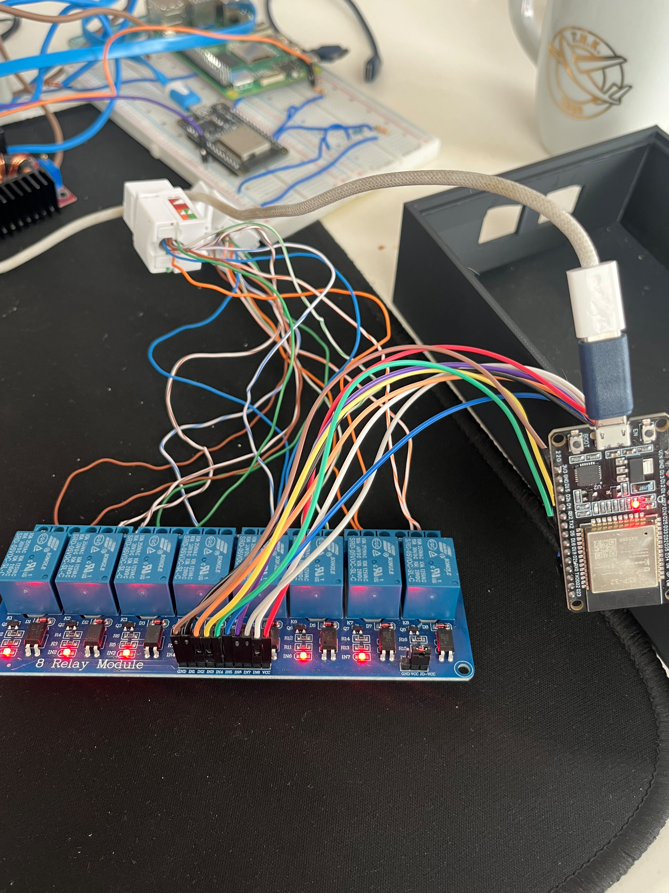

# Stage 16 — Sekiz Kanallı Röle Bağlantısı

**Durum:** ✅ GPIO/röle prototip testi ve ana firmware restorasyonu tamamlandı
**Sorumluluk:** Entegrasyon sınırı

## Amaç

ESP32’nin sekiz kanallı röle modülünü GPIO çıkışlarıyla kontrol edebildiğini,
active-low çalışma mantığını ve test sonrasında sistemin güvenli pasif duruma
dönebildiğini doğrulamak.

Bu aşama yalnızca düşük gerilimli prototip kontrolünü kapsar. Gerçek Ethernet
hattının, güç hattının veya başka bir yükün fiziksel izolasyonu bu aşamada
doğrulanmamıştır.

## Donanım bağlantısı

Prototipte 5 V, sekiz kanallı röle modülü kullanılmıştır.

| Röle kanalı | ESP32 GPIO | Etkin seviye | Pasif seviye |
|---:|---:|---|---|
| 1 | `13` | `LOW` | `HIGH` |
| 2 | `14` | `LOW` | `HIGH` |
| 3 | `18` | `LOW` | `HIGH` |
| 4 | `19` | `LOW` | `HIGH` |
| 5 | `23` | `LOW` | `HIGH` |
| 6 | `25` | `LOW` | `HIGH` |
| 7 | `26` | `LOW` | `HIGH` |
| 8 | `27` | `LOW` | `HIGH` |

Prototipte:

- Röle VCC hattı ESP32’nin USB ile beslenen VIN/5V hattından alınmıştır.
- ESP32 ve röle kartı arasında ortak GND kullanılmıştır.
- Röle kartı active-low çalışmaktadır.
- `LOW` röle kanalını etkinleştirir.
- `HIGH` röle kanalını pasif duruma getirir.

> Bu besleme düzeni yalnızca prototip çalışmasıdır. Sekiz röle bobininin
> uzun süreli ve eş zamanlı olarak ESP32 VIN/USB hattından beslenmesi güvenli
> veya üretime uygun kabul edilmemelidir.

## Firmware davranışı

Ana CyberHunter firmware’inde kullanılan pin dizisi:

```cpp
const uint8_t relayPins[8] = {
  13, 14, 18, 19, 23, 25, 26, 27
};
```

Mantıksal seviyeler:

```cpp
relayOn = LOW;
relayOff = HIGH;
```

Firmware başlangıcında pinler pasif duruma hazırlanır ve aşağıdaki kayıt
üretilir:

```text
ROLELER=KAPALI ESIK=BEKLENIYOR
```

Normal çalışma sırasında sekiz kanal grup hâlinde kontrol edilir. Kanallar
etkinleştirilirken ani akım değişimini azaltmak amacıyla aralarında `40 ms`
gecikme uygulanır.

## Bağımsız kanal testi

Sekiz GPIO için geçici, secret içermeyen bir donanım test sketch’i
hazırlanmıştır:

[`tests/hardware/relay_8channel_test.ino`](../../tests/hardware/relay_8channel_test.ino)

Test her kanal için şu işlemleri uygulamıştır:

1. Kanalı `LOW` seviyesine geçir.
2. GPIO readback değerini kontrol et.
3. Röle LED ve mekanik tepkisini gözlemle.
4. Kanalı `HIGH` seviyesine döndür.
5. Sonraki kanala geç.
6. Test sonunda bütün çıkışların `HIGH` olduğunu doğrula.

Test sonucu:

```text
FINAL_OUTPUT_STATE=ALL_OFF
TEST_RESULT=PASS
TEST_COMPLETE
```

ESP32 test sırasında yeniden başlamamıştır.

## Fiziksel gözlem

Test sırasında sekiz gösterge LED’inin yandığı, ardından kanalların test
sırasıyla kapandığı ve rölelerde mekanik anahtarlama sesi duyulduğu
gözlemlenmiştir.

Test bittikten sonra bütün gösterge LED’leri kapalı kalmıştır.

Bu gözlem röle kartının GPIO komutlarına tepki verdiğini gösterir. Kontakların
elektriksel olarak açılıp kapandığı multimetre ile ayrıca ölçülmemiştir.

## Açılış geçişi güvenlik bulgusu

Test firmware’i yüklendikten sonraki açılış aşamasında röle LED’lerinin geçici
olarak açık olduğu gözlemlenmiştir. GPIO pinleri yazılım tarafından pasif
seviyeye geçirildikçe kanallar kapanmıştır.

Bu nedenle mevcut prototipte yalnızca yazılım başlangıcına güvenilmemelidir.
Üretim tasarımında aşağıdaki önlemler değerlendirilmelidir:

- Röle girişlerinde tanımlı güvenli açılış seviyesi
- Uygun donanımsal pull-up/pull-down tasarımı
- Global röle enable hattı
- Ayrı röle sürücü katmanı
- Yeterli ve ayrı 5 V röle güç kaynağı
- Brownout ve yeniden başlama testleri
- Optik izolasyonun şemaya uygun kullanılması
- Kontakların multimetreyle süreklilik testi
- Yük altında sıcaklık ve kararlılık testi

## Ana firmware restorasyonu

Test tamamlandıktan sonra geçici röle test firmware’i kaldırılmış ve
CyberHunter ana firmware’i yeniden yüklenmiştir.

Doğrulanan başlangıç çıktısı:

```text
ROLELER=KAPALI ESIK=BEKLENIYOR
CYBERHUNTER AES-256-GCM I2C HAZIR
ADRES=0x08 SDA=21 SCL=22
WIFI=OK IP=<ESP32_LOCAL_IP> RSSI=-57
```

Raspberry Pi üzerinde:

- `/dev/i2c-1` erişilebilir durumdadır.
- ESP32 adresi `0x08` olarak görülmüştür.
- Inbox Worker timer `enabled` ve `active` durumundadır.
- Sistem durumu `running` olarak doğrulanmıştır.

## Test sonuçları

| Kontrol | Durum |
|---|---|
| Sekiz GPIO yapılandırması | ✅ Başarılı |
| Active-low kontrol | ✅ Doğrulandı |
| Bütün kanallarda `LOW` readback | ✅ Başarılı |
| Test sonunda bütün çıkışların pasif olması | ✅ Başarılı |
| LED tepkisi | ✅ Gözlemlendi |
| Mekanik anahtarlama sesi | ✅ Gözlemlendi |
| ESP32’nin test sırasında yeniden başlamaması | ✅ Doğrulandı |
| Ana firmware’in geri yüklenmesi | ✅ Tamamlandı |
| I²C `0x08` restorasyon kontrolü | ✅ Başarılı |
| Inbox Worker timer | ✅ Etkin ve aktif |
| Açılışta geçici röle etkinleşmesi | ⚠️ Gözlemlendi |
| Röle kontağı süreklilik testi | ⬜ Planlandı |
| Gerçek fiziksel hat izolasyonu | ⬜ Planlandı |
| Uzun süreli eş zamanlı yük testi | ⬜ Planlandı |

## Kanıtlar

- [Firmware röle yapılandırması](../../evidence/command-outputs/2026-10-01_stage-16_firmware-relay-configuration.txt)
- [Sekiz kanallı röle test sonucu](../../evidence/test-results/2026-10-01_stage-16_relay-channel-test.md)
- [Test sonrası ana firmware restorasyonu](../../evidence/command-outputs/2026-10-01_stage-16_post-test-restoration.txt)
- [Röle donanımı ve ESP32 bağlantısı](../../evidence/hardware-photos/2026-09-30_stage-16_relay-wiring-overview_photo.jpeg)



## Güvenlik sınırı

- Röle kontaklarına bu test kapsamında gerçek yük bağlanmamıştır.
- Şebeke elektriğiyle test yapılmamıştır.
- Ethernet hattının fiziksel olarak kesildiği doğrulanmamıştır.
- ESP32 VIN/USB hattı nihai röle güç kaynağı olarak kabul edilmemelidir.
- Açılış geçişi giderilmeden sistem güvenli fiziksel izolasyon mekanizması
  olarak değerlendirilmemelidir.
- Ham firmware gerçek Wi-Fi bilgileri veya anahtar içerebileceği için repoya
  eklenmemelidir.

## Sonuç

ESP32’nin sekiz active-low röle girişini tanımlanan GPIO pinleri üzerinden
kontrol edebildiği, bütün kanalların yazılım testinden geçtiği, röle kartının
görsel ve mekanik tepki verdiği ve ana firmware’in test sonrasında başarıyla
geri yüklendiği doğrulanmıştır.

Açılış sırasında geçici röle etkinleşmesi gözlendiğinden ve kontak sürekliliği
ölçülmediğinden bu düzen henüz üretim tipi fiziksel izolasyon sistemi olarak
kabul edilmemektedir.