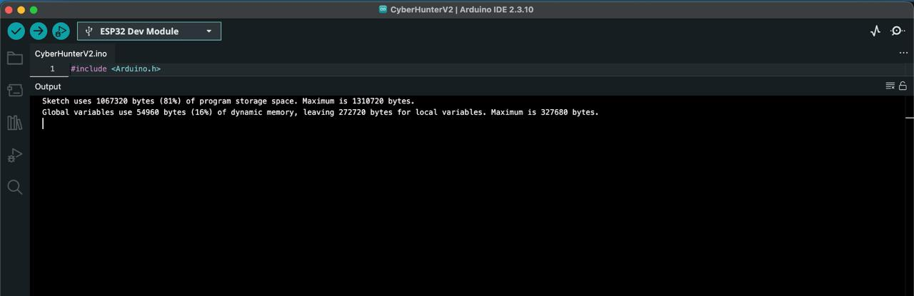

# Stage 18 — Güncel ESP32 Kodunun Hazırlanması

**Durum:** 🟡 Temiz derleme ve çalışma zamanı doğrulandı; kaynak güvenliği iyileştirmeleri ESP32 ekibinde
**Sorumluluk:** ESP32 ekibi; Raspberry Pi–ESP32 arayüz doğrulaması bu repo kapsamında

## Amaç

CyberHunter prototipinde kullanılan güncel ESP32 firmware’inin derlenebilir
olduğunu, Raspberry Pi ile I²C üzerinden haberleşebildiğini, şifreli olayları
işleyebildiğini, backend yapılandırmasını alabildiğini ve röle modülüne karar
komutu üretebildiğini belgelemek.

Bu repo ESP32 firmware geliştirmesinin ana kaynak reposu değildir. Firmware’in
tam güvenlik düzenlemesi, secret yönetimi, endpoint yapılandırması ve üretim
sürümünün yayımlanması ESP32 ekibinin sorumluluğundadır.

## İncelenen firmware sürümü

| Alan | Değer |
|---|---|
| Dosya adı | `CyberHunterV2.ino` |
| Dosya boyutu | `13.239 bayt` |
| SHA-256 | `2a1e8e8418c2d3e60b692060fbf2c69fa36cc794b11b6365ef675ac0760e61dd` |
| Arduino IDE | `2.3.10` |
| Kart profili | `ESP32 Dev Module` |
| Derleme durumu | Başarılı |

SHA-256 değeri, test edilen firmware sürümünün daha sonra aynı dosyayla
karşılaştırılabilmesi için kaydedilmiştir.

Ham firmware bu repoya eklenmemiştir. Kaynak dosya gerçek yapılandırma ve gizli
bilgi içerebildiğinden yalnızca anonimleştirilmiş teknik sonuçlar
belgelenmiştir.

## Temiz derleme sonucu

Güncel firmware Arduino IDE üzerinde `ESP32 Dev Module` hedefiyle başarıyla
derlenmiştir.

```text
Sketch uses 1067320 bytes (81%) of program storage space.
Maximum is 1310720 bytes.

Global variables use 54960 bytes (16%) of dynamic memory,
leaving 272720 bytes for local variables.
Maximum is 327680 bytes.
```

Derleme sırasında:

- `Compilation error` görülmedi.
- `exit status 1` görülmedi.
- Eksik kütüphane hatası görülmedi.
- Linker hatası görülmedi.
- Program alanı sınırı aşılmadı.
- Dinamik bellek sınırı aşılmadı.

Program belleğinin `%81` kullanılması çalışmayı engellememektedir. Ancak yeni
özellikler eklenirken firmware boyutu izlenmelidir.

## Doğrulanan firmware bileşenleri

| Bileşen | Durum | Açıklama |
|---|---|---|
| I²C slave adresi `0x08` | ✅ Doğrulandı | Kaynak ve gerçek I²C taramasıyla doğrulandı |
| SDA `GPIO21` | ✅ Doğrulandı | ESP32 tarafındaki veri hattı |
| SCL `GPIO22` | ✅ Doğrulandı | ESP32 tarafındaki saat hattı |
| AES-256-GCM | ✅ Doğrulandı | Şifreleme, doğrulama ve değiştirilmiş veri reddi test edildi |
| Frame yeniden birleştirme | ✅ Doğrulandı | Çok parçalı mesajlar birleştirildi |
| JSON doğrulaması | ✅ Doğrulandı | Zorunlu alan ve değer kontrolleri mevcut |
| `event_id` korelasyonu | ✅ Doğrulandı | Raspberry cevabıyla eşleşme sağlandı |
| Wi-Fi bağlantısı | ✅ Doğrulandı | Ana firmware geri yüklendikten sonra bağlantı kuruldu |
| Backend olay POST işlemi | ✅ Doğrulandı | Başarılı olaylarda HTTP `201` alındı |
| Dinamik config GET işlemi | ✅ Doğrulandı | `20`, `50` ve `70` eşikleri kullanıldı |
| Son geçerli eşik fail-safe davranışı | ✅ Doğrulandı | Config hatasında son `70` değeri korundu |
| Sekiz kanallı röle GPIO kontrolü | ✅ Doğrulandı | GPIO ve LED prototip testi tamamlandı |
| Dinamik izolasyon kararı | ✅ Doğrulandı | Risk `55`, eşik `50/70` senaryoları test edildi |
| Ana firmware restorasyonu | ✅ Doğrulandı | Test firmware’inden sonra ana firmware geri yüklendi |

## I²C adres kontrolü hakkında not

İlk statik kontrol betiği aşağıdaki sonucu üretmiştir:

```text
I2C adres 0x08: False
```

Bu sonuç firmware hatası değildir. Kontrol ifadesi kaynakta kullanılan aşağıdaki
tür dönüşümlü çağrıyı yakalayamamıştır:

```cpp
Wire.begin((uint8_t)0x08)
```

I²C adresi çalışma zamanında Raspberry Pi üzerinden doğrulanmıştır:

```text
/dev/i2c-1
ESP32 adresi: 0x08
```

Bu nedenle gerçek doğrulama sonucu başarılıdır.

## Dinamik eşik ve röle davranışı

Güncel entegrasyon testlerinde aynı risk skoru farklı eşiklerle
değerlendirilmiştir.

| Risk | Eşik | İzolasyon durumu | Röle/LED komutu |
|---:|---:|---|---|
| `55` | `50` | Aktif | Bobin enerjisiz, LED kapalı |
| `55` | `70` | Pasif | Bobin enerjili, LED açık |

Config endpoint erişilemediğinde son geçerli eşik korunmuştur:

```text
CONFIG_HTTP=502
RISK=55
ESIK=70
ROLE_LED=ACIK
```

Backend kaydı başarısız olduğunda ESP32 `processed:false` cevabı vermiş,
Raspberry Pi olayı retry kuyruğuna almış ve backend yeniden çalıştığında aynı
olay ikinci denemede başarıyla tamamlanmıştır.

## Ana firmware restorasyonu

Geçici röle test firmware’i kaldırıldıktan sonra güncel ana firmware yeniden
ESP32’ye yüklenmiştir.

Doğrulanan başlangıç çıktısı:

```text
ROLELER=KAPALI ESIK=BEKLENIYOR
CYBERHUNTER AES-256-GCM I2C HAZIR
ADRES=0x08 SDA=21 SCL=22
WIFI=OK IP=<ESP32_LOCAL_IP> RSSI=-57
```

Raspberry Pi tarafında:

```text
I2C adresi: 0x08
Inbox Worker timer: enabled
Inbox Worker timer: active
Sistem durumu: running
```

## Kaynak güvenliği incelemesi

Statik kontrol, güncel firmware’in çalışma açısından kullanılabilir olduğunu
ancak herkese açık repoya eklenmeye hazır olmadığını göstermiştir.

| Kontrol | Güncel durum | Sorumluluk |
|---|---|---|
| SSID kaynak içinde literal | 🔴 Mevcut | ESP32 ekibi |
| Wi-Fi parolası kaynak içinde literal | 🔴 Mevcut | ESP32 ekibi |
| AES anahtarı kaynak içinde literal | 🔴 Mevcut | ESP32 ekibi |
| Geçici backend/tünel adresi | 🔴 Mevcut | ESP32 ve backend ekipleri |
| `setInsecure()` kullanımı | 🔴 Mevcut | ESP32 ekibi |
| Ayrı `secrets.h` kullanımı | 🔴 Mevcut değil | ESP32 ekibi |
| Sertifika doğrulaması | 🔴 Uygulanmadı | ESP32 ekibi |
| Secret provisioning prosedürü | ⬜ Planlandı | ESP32 ekibi |
| Anahtar döndürme prosedürü | ⬜ Planlandı | ESP32 ekibi |

Gerçek değerler bu dokümana veya kanıt dosyalarına yazılmamıştır.

## Backend sözleşmesi uyumsuzluğu

Firmware içinde eski sorgu endpoint’ine yönelik aşağıdaki işlem bulunmaktadır:

```text
POST /api/security-events/query
```

Güncel backend OpenAPI sözleşmesinde sorgulama işlemleri şu biçimdedir:

```text
GET /api/security-events
GET /api/security-events/{event_id}
GET /api/security-events/summary
```

Bu nedenle:

- Olay oluşturma için kullanılan `POST /api/security-events` uyumludur.
- Device Config için kullanılan `GET /api/device-config/{device_id}` uyumludur.
- Eski `POST /api/security-events/query` işlemi güncel backend ile uyumlu
  değildir.
- Query özelliğinin ESP32 ekibi ve backend ekibi tarafından ortak sözleşmeye
  göre güncellenmesi gerekir.

Bu uyumsuzluk olay POST hattını veya Stage 15–17 testlerini geçersiz kılmaz.
Yalnızca ESP32’nin backend sorgu özelliğini etkiler.

## Açılış geçişi bulgusu

Röle donanım testi sırasında ESP32 boot aşamasında, GPIO pinleri firmware
tarafından yapılandırılmadan önce röle LED’lerinin geçici olarak
etkinleşebildiği görülmüştür.

Ana firmware `setup()` aşamasına ulaştığında röleler pasif duruma alınmaktadır.
Ancak üretim sisteminde güvenli başlangıç yalnızca yazılıma bırakılmamalıdır.

ESP32 ve donanım ekibi tarafından değerlendirilmesi gerekenler:

- Güvenli açılış seviyesi
- Donanımsal pull-up/pull-down
- Global röle enable hattı
- Ayrı röle sürücü ve besleme katmanı
- Brownout ve yeniden başlama testleri

## Kanıt



Görselde:

- Arduino IDE `2.3.10`
- `ESP32 Dev Module`
- Başarılı derleme
- Program belleği kullanımı
- Dinamik bellek kullanımı

görülmektedir.

Ekran görüntüsünde Wi-Fi parolası, AES anahtarı, backend adresi veya kişisel
dosya yolu bulunmamaktadır.

## Merkezi İşleme Birimi açısından sonuç

Merkezi İşleme Birimi kapsamında aşağıdaki Raspberry Pi–ESP32 arayüzleri
doğrulanmıştır:

- AES-GCM korumalı I²C mesaj gönderimi
- Frame bölme ve yeniden birleştirme
- `event_id` tabanlı cevap korelasyonu
- `processed:true/false` kontrolü
- Retry ve archive iş akışı
- Dinamik eşik alma
- Son geçerli eşik davranışı
- Röle karar komutunun üretilmesi
- Ana firmware sonrasında I²C `0x08` erişimi

Bu repo açısından ESP32 arayüz doğrulaması tamamlanmıştır.

## ESP32 ekibine devredilen görevler

1. Wi-Fi parolasını kaynak koddan çıkarmak
2. AES anahtarını güvenli provisioning mekanizmasına taşımak
3. Geçici backend/tünel adresini kaldırmak
4. `secrets.h` veya güvenli eşdeğer yapılandırma kullanmak
5. `setInsecure()` kullanımını kaldırmak
6. Sunucu sertifikası veya CA doğrulaması eklemek
7. Backend query sözleşmesini güncellemek
8. Açılış sırasında rölelerin pasif kalmasını donanımsal olarak garanti etmek
9. Gerçek röle kontak geri bildirimi eklemek
10. ESP32 firmware’ini kendi sorumluluk reposunda yayımlamak

## Sonuç

Güncel ESP32 firmware’i Arduino IDE üzerinde başarıyla derlenmiş, ESP32’ye
yüklenmiş ve Raspberry Pi ile olan temel arayüzleri çalışma zamanında
doğrulanmıştır.

Firmware’in tam kaynak güvenliği ve üretime hazırlanması ESP32 ekibinin
sorumluluğundadır. Bu nedenle Stage 18, Merkezi İşleme Birimi arayüzü açısından
tamamlanmış; ESP32 kaynak güvenliği açısından devam eden çalışma olarak
kaydedilmiştir.
