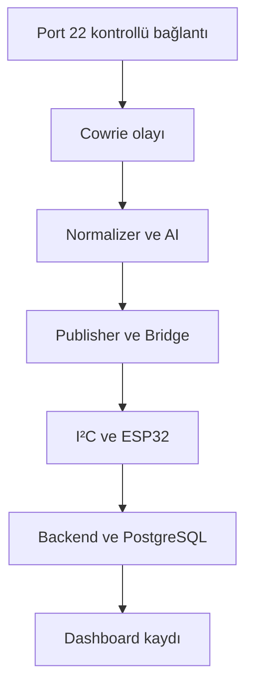

# Stage 19 — Uçtan Uca Son Test

**Durum:** 🟡 Kısmi uçtan uca doğrulama tamamlandı; tam ortak kabul testi planlandı
**Sorumluluk:** Tüm ekiplerin ortak kabul testi

## Amaç

CyberHunter veri hattının farklı bölümlerinde doğrulanan entegrasyonları tek
bir kabul testi altında toplamak ve henüz tamamlanmamış uçtan uca korelasyon
adımlarını açık biçimde göstermek.

Hedeflenen tam akış:



Tam kabul kriteri, port `22` üzerinden başlayan tek bir kontrollü olayın aynı
`event_id` ile bütün katmanlarda izlenebilmesidir.

## Mevcut doğrulama durumu

CyberHunter hattının tamamı tek bir olay kimliğiyle henüz doğrulanmamıştır.
Bunun yerine iki ayrı doğrulama zinciri tamamlanmıştır.

### Honeypot ve normalizasyon zinciri

Aşağıdaki bölüm doğrulanmıştır:

```text
Port 22
→ nftables yönlendirmesi
→ Cowrie port 2222
→ Cowrie JSON olayı
→ Normalizer
→ Ortak JSON şeması
```

Doğrulanan sonuçlar:

- Port `22` bağlantısı Cowrie’ye yönlendirildi.
- Cowrie `cowrie.client.kex` ve `cowrie.session.closed` olaylarını oluşturdu.
- Ham Cowrie olayları JSON formatında kaydedildi.
- `56` Cowrie olayı normalleştirildi.
- Normalleştirilmiş bütün olaylarda UUIDv5 `event_id` bulundu.
- Geçersiz JSON satırı görülmedi.
- `command.executed` olaylarında `details.command` alanı korundu.

Bu zincirdeki aynı olay kimliğinin AI, Publisher, ESP32 ve dashboard’a kadar
ilerlediği henüz kanıtlanmamıştır.

### Bridge, ESP32 ve backend zinciri

Aşağıdaki bölüm kontrollü olaylarla doğrulanmıştır:

```text
Kontrollü JSON olayı
→ Bridge inbox
→ Inbox Worker
→ AES-256-GCM
→ I²C
→ ESP32
→ Backend
→ PostgreSQL
→ Dashboard
```

Referans olay:

```text
event_id: evt-stage09-20261001T122857Z
risk_score: 0
```

Bu olay için:

- Bridge dosyayı sahiplendi.
- Mesaj AES-256-GCM ile şifrelendi.
- Mesaj `15` I²C frame’iyle ESP32’ye gönderildi.
- ESP32 cevabı `10` frame’den yeniden birleştirildi.
- AES-GCM doğrulaması başarılı oldu.
- Cevaptaki `event_id` gönderilen olayla eşleşti.
- `processed:true` sonucu alındı.
- Olay archive dizinine taşındı.
- Aynı `event_id` backend API üzerinden okundu.
- Aynı `event_id` PostgreSQL tablolarında bulundu.
- Olay dashboard üzerinde görüntülendi.

## Dinamik izolasyon senaryoları

Aynı risk skoru iki farklı eşikle test edilmiştir.

| Risk skoru | İzolasyon eşiği | Karşılaştırma | Sonuç |
|---:|---:|---|---|
| `55` | `50` | `55 >= 50` | İzolasyon aktif, röle bobini enerjisiz, LED kapalı |
| `55` | `70` | `55 < 70` | İzolasyon pasif, röle bobini enerjili, LED açık |

Her iki senaryoda backend olayı `HTTP 201` ile kabul etmiştir.

Bu testler röle/LED komutunu doğrular. Röle kontaklarının gerçek Ethernet veya
güç hattını kestiği doğrulanmamıştır.

## Backend kesintisi ve retry testi

Config ve olay endpoint’inin erişilemez olduğu kontrollü testte:

```text
CONFIG_HTTP=502
HTTP_CODE=502
RISK=55
ESIK=70
ROLE_LED=ACIK
```

sonucu alınmıştır.

ESP32 son geçerli `70` eşik değerini korumuş ancak backend kaydı
tamamlanmadığı için:

```json
{
  "processed": false
}
```

cevabını vermiştir.

Raspberry Pi Inbox Worker:

```text
status: retry_scheduled
attempts: 1
```

durumunu kaydetmiştir.

Backend yeniden çalıştırıldığında aynı olay:

```text
event_id: evt-s15-retain70-150625
attempts: 2
status: success
EVENT_ID MATCH: OK
```

sonucuyla tamamlanmış ve archive dizinine taşınmıştır.

Bu test geçici backend hatasının olay kaybına neden olmadığını doğrulamıştır.

## PostgreSQL korelasyonu

Referans `evt-stage09-20261001T122857Z` olayı aşağıdaki tablolarda aynı olay
kimliğiyle bulunmuştur:

| Tablo | Doğrulanan bilgiler |
|---|---|
| `security_events` | Olay zamanı, protokol, hedef port, olay türü, risk skoru |
| `esp32_assessments` | Cihaz kimliği, ESP32 skoru, karar, `processed:true` |
| `response_actions` | Eylem, durum, önem seviyesi, politika sürümü |

İlgili tablolarda olay sayısı `1` olarak görülmüştür.

Veritabanında:

```text
security_events.event_id
```

alanı için benzersiz indeks bulunmaktadır.

Bu yapı aynı `event_id` değerinin ikinci bir `security_events` kaydı olarak
eklenmesini engeller. Bununla birlikte aynı olayın API’ye kontrollü olarak
ikinci kez gönderildiği bağımsız bir tekrar testi henüz kaydedilmemiştir.

## Test sırası ve gerçekleşen durum

| No | Test adımı | Mevcut sonuç | Durum |
|---:|---|---|---|
| 1 | Raspberry Pi tarih, NTP ve servis sağlıkları | Saat dilimi ve NTP servisi doğrulandı; son çıktılardan birinde `NTPSynchronized=no` görüldü | 🟡 Kısmi |
| 2 | Backend, PostgreSQL, dashboard ve tünel | API, PostgreSQL, dashboard ve geçici tünel kullanıldı | ✅ |
| 3 | ESP32 config endpoint’i | `20`, `50` ve `70` eşikleri alındı | ✅ |
| 4 | Güncel firmware derleme ve yükleme | Arduino IDE temiz derleme ve cihaz restorasyonu doğrulandı | ✅ |
| 5 | Düşük riskli benzersiz olay | Risk `0` olan `evt-stage09-...` olayı kullanıldı | ✅ |
| 6 | Olayın Cowrie/AI veya kontrollü girişten Bridge’e ulaşması | Kontrollü girişten Bridge’e ulaştı; Cowrie’den aynı ID ile tam zincir doğrulanmadı | 🟡 Kısmi |
| 7 | Inbox Worker, I²C ve ESP32 response | Şifreli gönderim, decrypt ve event ID eşleşmesi doğrulandı | ✅ |
| 8 | Düşük risk/eşik altı röle davranışı | Risk `55`, eşik `70`, LED açık | ✅ |
| 9 | Yüksek risk/eşik üstü röle davranışı | Risk `55`, eşik `50`, LED kapalı | ✅ |
| 10 | PostgreSQL ve dashboard korelasyonu | Referans düşük risk olayı tamamen doğrulandı; bütün test olayları için ortak rapor hazırlanmadı | 🟡 Kısmi |
| 11 | Idempotency testi | Benzersiz indeks ve tek kayıt doğrulandı; açık tekrar gönderme testi yapılmadı | 🟡 Kısmi |
| 12 | Backend/ESP32 kesintisi | Backend hatasında retry; ESP32 inaktifken üç deneme ve `rejected` doğrulandı | ✅ |

## Tamamlanan kabul kontrolleri

| Kabul kontrolü | Durum |
|---|---|
| Bridge’den dashboard’a aynı `event_id` korelasyonu | ✅ Tamamlandı |
| AES-GCM kimlik doğrulaması | ✅ Tamamlandı |
| I²C frame yeniden birleştirme | ✅ Tamamlandı |
| ESP32 `processed:true` cevabı | ✅ Tamamlandı |
| Backend ve PostgreSQL kaydı | ✅ Tamamlandı |
| Dashboard görüntüleme | ✅ Tamamlandı |
| Dinamik eşik alma | ✅ Tamamlandı |
| Eşik altı davranış | ✅ Tamamlandı |
| Eşik üstü davranış | ✅ Tamamlandı |
| Config hatasında son geçerli eşik | ✅ Tamamlandı |
| Backend hatasında retry | ✅ Tamamlandı |
| Başarılı olayın archive’a taşınması | ✅ Tamamlandı |
| Test sonrası inbox/processing temizliği | ✅ Tamamlandı |

## Açık kabul kontrolleri

Tam uçtan uca kabul için aşağıdaki testler henüz gereklidir:

1. Tek bir port `22` Cowrie olayının aynı `event_id` ile Normalizer, AI,
   Publisher, Bridge, ESP32, PostgreSQL ve dashboard boyunca izlenmesi
2. Aynı olayın API’ye tekrar gönderilmesiyle açık idempotency testi
3. I²C kablosunun açıkça sökülüp geri takıldığı fiziksel kurtarma testi
4. Son test anında NTP senkronizasyonunun `yes` olduğunun doğrulanması
5. Röle kontaklarının elektriksel süreklilik testi
6. Gerçek Ethernet veya güvenli test hattı üzerinde fiziksel izolasyon testi
7. Runtime loglarında hassas bilgilerin otomatik maskelendiğinin doğrulanması

## Güvenlik değerlendirmesi

Repo kanıtları anonimleştirilmiştir:

- Gerçek Raspberry Pi ve ESP32 IP adresleri maskelenmiştir.
- MAC adresleri yayımlanmamıştır.
- Wi-Fi parolası eklenmemiştir.
- AES anahtarı eklenmemiştir.
- Backend anahtarları eklenmemiştir.
- Geçici tünel adresi kanıtlardan çıkarılmıştır.
- Uzun HTTP hata gövdeleri kanıt dosyalarına alınmamıştır.

Ancak çalışma zamanı firmware ve loglarında aşağıdaki iyileştirmeler ESP32 ve
ilgili ekiplerin sorumluluğundadır:

- Wi-Fi bilgilerinin kaynak koddan çıkarılması
- AES anahtarının güvenli provisioning yöntemiyle yönetilmesi
- `setInsecure()` kullanımının kaldırılması
- TLS sertifika doğrulaması
- Gerçek IP ve endpoint değerlerinin loglarda maskelenmesi
- Geçici backend/tünel adreslerinin kaldırılması

Bu nedenle “hiçbir aşamada hassas bilgi açık loglanmamalıdır” kriteri repo
kanıtları için sağlanmış, bütün çalışma zamanı bileşenleri için henüz tam olarak
doğrulanmamıştır.

## İlgili aşamalar

- [Stage 4 — Cowrie SSH Honeypot](04-cowrie-honeypot.md)
- [Stage 6 — Normalizer](06-normalizer.md)
- [Stage 8 — AI Publisher](08-ai-publisher.md)
- [Stage 9 — Bridge Pipeline](09-bridge-pipeline.md)
- [Stage 10 — Raspberry Pi ve ESP32 I²C](10-i2c-link.md)
- [Stage 11 — I²C Veri Güvenliği](11-i2c-security.md)
- [Stage 12 — ESP32 Doğrulama](12-esp32-validation.md)
- [Stage 14 — Backend ve Dashboard](14-backend-dashboard.md)
- [Stage 15 — Dinamik İzolasyon Eşiği](15-dynamic-threshold.md)
- [Stage 16 — Sekiz Kanallı Röle](16-relay-hardware.md)
- [Stage 17 — Röle LED Senaryosu](17-relay-led-scenario.md)
- [Stage 18 — Güncel ESP32 Kodu](18-current-esp32-code.md)

## Kabul sonucu

Mevcut kanıtlarla aşağıdaki kontrollü zincir başarıyla doğrulanmıştır:

```text
Kontrollü JSON olayı
→ Bridge
→ AES-GCM korumalı I²C
→ ESP32
→ Backend
→ PostgreSQL
→ Dashboard
```

Port `22` üzerinden Cowrie’ye giriş ve Cowrie’den normalleştirilmiş olaya kadar
olan zincir de ayrı olarak doğrulanmıştır.

Ancak tek bir olay kimliği henüz port `22` girişinden dashboard satırına kadar
kesintisiz izlenmemiştir. Bu nedenle Stage 19 tam ekip kabul testi
`tamamlandı` olarak işaretlenmemiştir.

## Sonuç

CyberHunter prototipinin ana entegrasyon parçaları ayrı ayrı ve kontrollü
zincirler hâlinde çalışmaktadır. Bridge’den dashboard’a event ID korelasyonu,
I²C güvenliği, ESP32 cevabı, dinamik eşik, röle LED kararı, backend kaydı ve
retry davranışı doğrulanmıştır.

Tam kabul için kalan temel görev, port `22` üzerinden başlayan tek bir olayın
aynı `event_id` ile bütün işlem katmanlarından geçirilmesidir.
