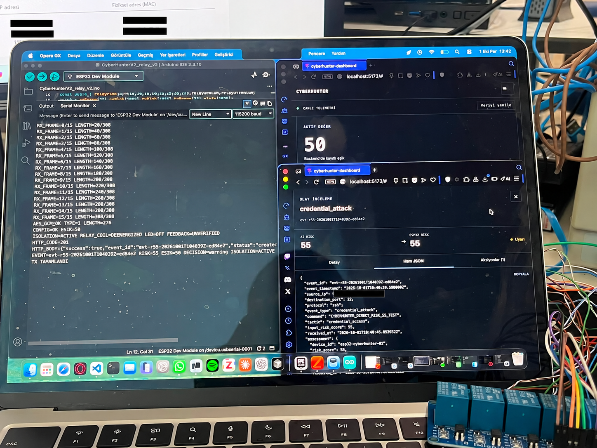
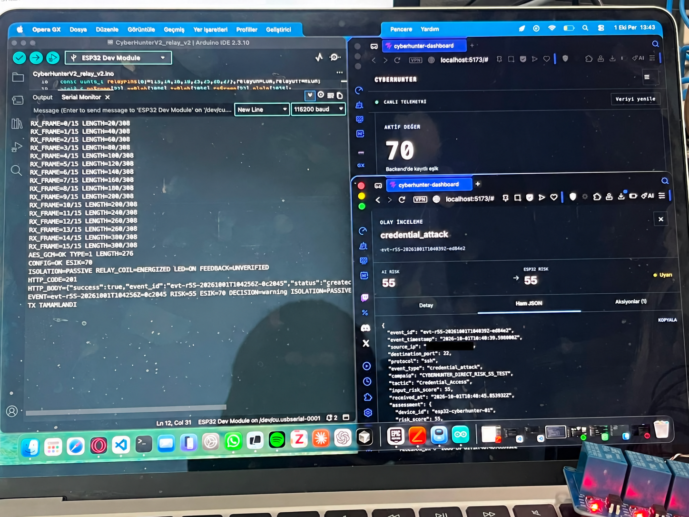

# Stage 17 — Dinamik Eşik ve Röle LED Senaryosu

**Tarih:** 2026-10-01  
**Kontrollü risk skoru:** `55`  
**Test türü:** Görsel LED ve röle komutu doğrulaması  
**Sonuç:** ✅ Prototip karar senaryoları doğrulandı

## Amaç

Aynı risk skoru için dinamik izolasyon eşiği değiştirilerek ESP32’nin röle/LED
komutunun değiştiğini doğrulamak.

Testte gerçek Ethernet veya güç hattı kullanılmamıştır. Sekiz kanallı röle
modülünün gösterge LED’leri prototip davranış göstergesi olarak kullanılmıştır.

## Senaryo A — Risk 55, eşik 50

Karşılaştırma:

```text
55 >= 50
```

Beklenen davranış:

```text
ISOLATION=ACTIVE
RELAY_COIL=DEENERGIZED
LED=OFF
```

Gerçekleşen çıktı:

```text
CONFIG=OK ESIK=50
ISOLATION=ACTIVE RELAY_COIL=DEENERGIZED LED=OFF FEEDBACK=UNVERIFIED
HTTP_CODE=201
EVENT=<CONTROLLED_EVENT_ID_A> RISK=55 ESIK=50 DECISION=warning ISOLATION=ACTIVE
```

Sonuç:

- Backend’den `50` eşik değeri alındı.
- `55 >= 50` koşulu sağlandı.
- İzolasyon kararı aktif üretildi.
- Röle bobini enerjisiz duruma geçirildi.
- Gösterge LED’leri kapandı.
- Backend olayı `HTTP 201` ile kabul etti.

Kanıt:



Bu görselde Serial Monitor’daki olay ile dashboard’da açılan olay aynı
kontrollü senaryoya aittir.

## Senaryo B — Risk 55, eşik 70

Karşılaştırma:

```text
55 < 70
```

Beklenen davranış:

```text
ISOLATION=PASSIVE
RELAY_COIL=ENERGIZED
LED=ON
```

Gerçekleşen çıktı:

```text
CONFIG=OK ESIK=70
ISOLATION=PASSIVE RELAY_COIL=ENERGIZED LED=ON FEEDBACK=UNVERIFIED
HTTP_CODE=201
EVENT=<CONTROLLED_EVENT_ID_B> RISK=55 ESIK=70 DECISION=warning ISOLATION=PASSIVE
```

Sonuç:

- Backend’den `70` eşik değeri alındı.
- `55 < 70` koşulu sağlandı.
- İzolasyon kararı pasif üretildi.
- Röle bobini enerjili duruma geçirildi.
- Gösterge LED’leri açıldı.
- Backend olayı `HTTP 201` ile kabul etti.

Kanıt:



Bu görselde Serial Monitor’daki son test olayı ile dashboard’da açık olan olay
farklı `event_id` değerleri taşımaktadır. Bu nedenle görsel yalnızca eşik,
röle komutu ve LED durumu kanıtı olarak kullanılmaktadır; uçtan uca olay
korelasyonu kanıtı değildir.

## Açılış davranışı

Stage 16 testinde ESP32 açılışı sırasında röle LED’lerinin geçici olarak etkin
olabildiği gözlemlenmiştir. Ana firmware `setup()` aşamasına ulaştığında
kanallar pasif seviyeye geçirilir.

Bu nedenle aşağıdaki iki durum ayrı değerlendirilmelidir:

| Aşama | Gözlenen davranış |
|---|---|
| Boot ve GPIO’ların henüz yapılandırılmadığı kısa dönem | Geçici LED/röle etkinleşmesi mümkün |
| Ana firmware röle başlangıcı tamamlandıktan sonra | Röleler kapalı, eşik bekleniyor |

## Değerlendirme

| Kontrol | Beklenen | Gerçekleşen | Durum |
|---|---|---|---|
| Eşik `50` alınması | `CONFIG=OK ESIK=50` | Eşik alındı | ✅ |
| `55 >= 50` karşılaştırması | İzolasyon aktif | `ISOLATION=ACTIVE` | ✅ |
| Aktif izolasyon LED komutu | LED kapalı | `LED=OFF` | ✅ |
| Eşik `70` alınması | `CONFIG=OK ESIK=70` | Eşik alındı | ✅ |
| `55 < 70` karşılaştırması | İzolasyon pasif | `ISOLATION=PASSIVE` | ✅ |
| Pasif izolasyon LED komutu | LED açık | `LED=ON` | ✅ |
| Backend olay kaydı | HTTP `2xx` | `HTTP 201` | ✅ |
| ESP32 yeniden başlamaması | Reset olmamalı | Reset gözlenmedi | ✅ |
| Röle kontak geri bildirimi | Elektriksel ölçüm | `FEEDBACK=UNVERIFIED` | ⬜ |
| Gerçek fiziksel hat izolasyonu | Hat kesilmeli | Test edilmedi | ⬜ |

## Doğrulama sınırı

`FEEDBACK=UNVERIFIED` sonucu, röle kontaklarının gerçek durumunun ESP32’ye geri
bildirilmediğini gösterir.

Bu test şunları doğrular:

- Dinamik eşik değerinin alınması
- Risk/eşik karşılaştırması
- İzolasyon kararının üretilmesi
- Röle bobini komutu
- Gösterge LED davranışı
- Backend’in olayı kabul etmesi

Bu test şunları doğrulamaz:

- Röle kontaklarının elektriksel sürekliliği
- Ethernet hattının fiziksel olarak kesilmesi
- Güç hattının fiziksel olarak kesilmesi
- Yük altında uzun süreli çalışma
- Üretim tipi fail-safe davranışı